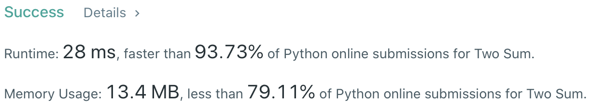

# Problem
[1. Two Sum](https://leetcode.com/problems/two-sum/)

# Performance


# Python Solution
```Python
class Solution:
    def twoSum(self, nums: List[int], target: int) -> List[int]:
        hashTable = dict()

        # ==================================================
        #  Array + Hash Table                              =
        # ==================================================
        # time  : O(n)
        # space : O(n)
        
        for i in range( len(nums) ):
            remain = target - nums[i]
            
            if remain in hashTable:
                return [i, hashTable[remain]]
            
            #:  Since there is only one exact solution, it has no problem to overwrite the record
            hashTable[nums[i]] = i
```
            
# Java Solution
```Java
class Solution {
    /**  
     * @time  : O(n)
     * @space : O(n)
     */
    
    public int[] twoSum(int[] nums, int target) {
        Map<Integer, Integer> map = new HashMap<>();
        
        for( int i = 0; i < nums.length; i++ ) {
            int remain = target - nums[i];
            if( map.containsKey(potentialMatch) ) {
                return new int[] {i, map.get(potentialMatch)};
            }
            map.put(nums[i], i);
        }
    }
}
```
