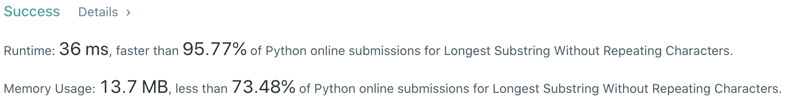

# Problem
[3. Longest Substring w/o Repeating Characters](https://leetcode.com/problems/longest-substring-without-repeating-characters)

# Performance


# Python
```Python
class Solution:
    def lengthOfLongestSubstring(self, s: str) -> int:

        # ==================================================
        #  Hash Table + Sliding Window (Two Pointer)       =
        # ==================================================
        # time  : O(n)
        # space : O(n)

        # (base case)
        if not s: return 0
        if len(s) == 1: return 1
        
        curStr = set()
        maxLen = float('-inf')
        l, r = 0, 0
        
        while r < len(s):
            # (1) No duplicate, add to table and move fast pointer
            if s[r] not in curStr: 
                curStr.add(s[r])
                maxLen = max(maxLen, len(curStr))
                r += 1
            
            # (2) Duplicate, remove from table and move slow pointer
            else:
                curStr.remove(s[l])
                l += 1
            
        return maxLen
```
   
# Java
```Java
class Solution {
    /**  
     * @time  : O(n)
     * @space : O(n)
     */
    public int lengthOfLongestSubstring(String s) {
        Map<Character, Integer> hashTable = new HashMap<>();
        int ans = 0, slowP = 0, fastP = 0;
        
        int length = s.length();
        if( length == 0 ){ return 0; }
        
        while( fastP < length ){
            char curChar = s.charAt( fastP );
            
            if( !hashTable.containsKey( curChar ) ){
                hashTable.put( curChar, fastP );
                fastP++;
                ans = Math.max( ans, fastP-slowP );
                
            } else {
                curChar = s.charAt( slowP );
                hashTable.remove( curChar );
                slowP++;
            }
        }
        
        return ans;
    }
}
```
