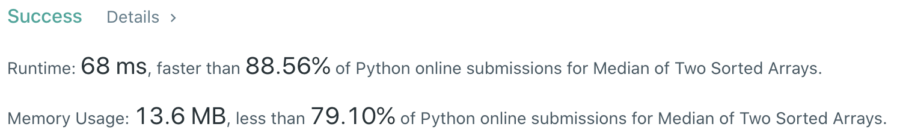
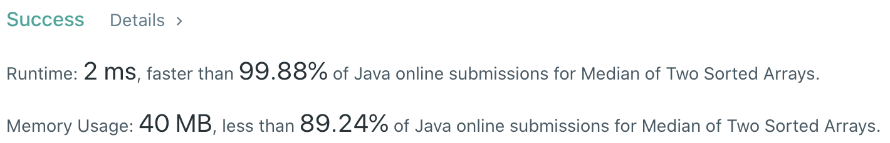

# Problem
[4. Median of Two Sorted Arrays](https://leetcode.com/problems/median-of-two-sorted-arrays/)

# Performance



# Python
```Python
class Solution:
    def findMedianSortedArrays(self, nums1: List[int], nums2: List[int]) -> float:
        
        # ==================================================
        #  Array + Binary Seearch                          =
        # ==================================================
        # time  : O(log(min(m,n)))
        # space : O(1)
        
        if len(nums1) > len(nums2): return self.findMedianSortedArrays(nums2, nums1)
        
        m, n = len(nums1), len(nums2)
        total = m + n
        size = (total + 1) // 2
        
        l, r = 0, len(nums1)
        while l <= r:
            p1 = (l + r) // 2
            p2 = size - p1
            
            nums1_left  = float('-inf') if p1 == 0 else nums1[p1 - 1]
            nums1_right = float('inf')  if p1 == m else nums1[p1]
            nums2_left  = float('-inf') if p2 == 0 else nums2[p2 - 1]
            nums2_right = float('inf')  if p2 == n else nums2[p2]
            
            if   nums1_left > nums2_right: r = p1 - 1
            elif nums2_left > nums1_right: l = p1 + 1
            else:
                if total & 1: return max(nums1_left, nums2_left)
                return (max(nums1_left, nums2_left) + min(nums1_right, nums2_right)) / 2
```

# Java
```Java
class Solution {
    /**
     * @time  : O(log(min(m,n)))
     * @space : O(1)
     */
    
    public double findMedianSortedArrays(int[] nums1, int[] nums2) {
        if(nums1.length > nums2.length) return findMedianSortedArrays(nums2, nums1);
        
        int m = nums1.length, n = nums2.length;
        int total = m + n;
        int size  = (total + 1) / 2;
        
        int l = 0, r = m;
        while(l <= r) {
            int p1 = (l + r) / 2;
            int p2 = size - p1;
            
            int num1_left  = (p1 == 0) ? Integer.MIN_VALUE : nums1[p1 - 1];
            int num1_right = (p1 == m) ? Integer.MAX_VALUE : nums1[p1];
            int num2_left  = (p2 == 0) ? Integer.MIN_VALUE : nums2[p2 - 1];
            int num2_right = (p2 == n) ? Integer.MAX_VALUE : nums2[p2];
            
            if      (num1_left > num2_right) r = p1 - 1;
            else if (num2_left > num1_right) l = p1 + 1;
            else {
                if(total % 2 != 0) return (double) Math.max(num1_left, num2_left);
                return ((double)Math.max(num1_left, num2_left) + Math.min(num1_right, num2_right)) / 2;
            }
        }
        
        return -1;
    }
}
```