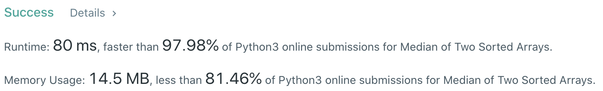

# Problem
[4. Median of Two Sorted Arrays](https://leetcode.com/problems/median-of-two-sorted-arrays)

# Performance


# Python
```Python
class Solution:
    def findMedianSortedArrays(self, nums1: List[int], nums2: List[int]) -> float:
        A, B  = nums1, nums2
        
        #:  take shorter array (here is A) to do Binary Search
        if len(B) < len(A): A, B = B, A
            
        lenA  = len(A)
        lenB  = len(B)
        total = lenA + lenB
        half  = total // 2
        even  = True if total % 2 == 0 else False
        
        # ==================================================
        #  Array + Binary Seearch                          =
        # ==================================================
        # time  : O(log(m+n))
        # space : O(1)
        
        l, r = 0, len(A)-1
        while True:
            indexA = (l+r) // 2
            indexB = half - indexA - 2
            
            #:  assign value to INFINITY to handle edge case
            leftA  = A[indexA]     if indexA     >= 0     else float("-inf")
            rightA = A[indexA + 1] if (indexA+1) < len(A) else float("inf")
            leftB  = B[indexB]     if indexB     >= 0     else float("-inf")
            rightB = B[indexB + 1] if (indexB+1) < len(B) else float("inf")
            
            #:  left partition is correct
            if leftA <= rightB and leftB <= rightA:
                if not even: return min( rightA, rightB )
                else: return ( min(rightA, rightB) + max(leftA, leftB) ) / 2
            
            #:  re-define RIGHT index to do Binary Search
            elif leftA > rightB: r = indexA - 1
                
            #:  re-refine LEFT index to do Binary Search
            elif leftB > rightA: l = indexA + 1
```

# Java
```Java
class Solution {
    /**  
     * @time  : O(log(m+n))
     * @space : O(1)
     */
    public double findMedianSortedArrays(int[] nums1, int[] nums2) {
        
    }
}
```
