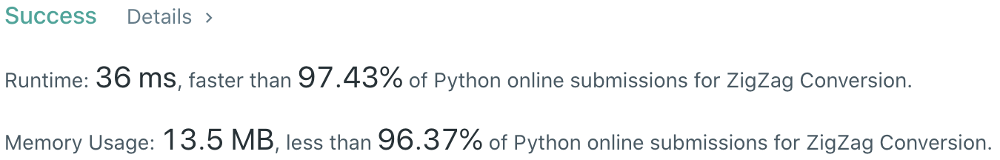

# Problem
[6. Zigzag Conversion](https://leetcode.com/problems/zigzag-conversion)

# Performance


# Python
```Python3
class Solution:
    def convert(self, s: str, numRows: int) -> str:
        #: (base case)
        if numRows == 1: return s
        
        # ==================================================
        #  String + Math                                   =
        # ==================================================
        # time  : O(n)
        # space : O(1)
        
        ret = ''
        cycle = numRows + numRows - 2
        
        for i in range(numRows):
            j = 0
            
            while i+j < len(s):
                # CYCLE element
                ret += s[i+j]
                
                # INNER element
                index = j + cycle - i
                if i != 0 and i != numRows - 1 and index < len(s):
                    ret += s[index]
                
                j += cycle
                
        return ret
```

# Java
```Java
class Solution {
    /**
     * @time  : O(n)
     * @space : O(1)
     */
    public String convert(String s, int numRows) {
        if( numRows == 1 ) return s;
        
        StringBuilder ret = new StringBuilder();
        int cycle = numRows * 2 - 2;
            
        for(int i = 0 ; i < numRows ; i++){
            int j = 0;
            
            while(i+j < s.length()){
                ret.append(s.charAt(i+j));
                
                int index = j + cycle - i;
                if(i != 0 && i != numRows - 1 && index < s.length()){
                    ret.append(s.charAt(index));
                }
                    
                j += cycle;
            }
        }
        
        return ret.toString();
    }
}
```
