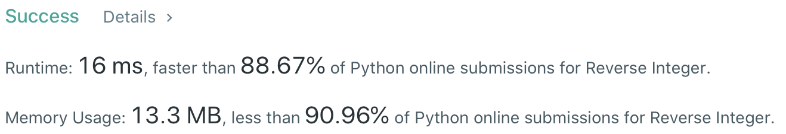

# Problem
[7. Reverse Integer](https://leetcode.com/problems/reverse-integer/)

# Performance


# Python Solution
```Python
class Solution:
    def reverse(self, x: int) -> int:
        #:  (edge case)
        if x == 0: return x
        
        # ==================================================
        #  Math                                            =
        # ==================================================
        # time  : O(log(n))
        # space : O(1)
        
        ans  = 0
        sign = 1 if x > 0 else -1
        x    = abs(x)
        
        while x:
            pop = x % 10
            x //= 10
            
            ans = ans*10 + pop
            if ans >= 2**31-1: return 0
            
        return sign * ans
```


# Java Solution
```Java
class Solution {
    public int reverse(int x) {
        if( x == 0 ) return x;
        
        int ans = 0;
        
        while( x != 0 ){
            int pop = x % 10;
            x /= 10;
            
            if( ans > Integer.MAX_VALUE/10 || ( ans == Integer.MAX_VALUE / 10 && pop >  7 ) ) return 0;
            if( ans < Integer.MIN_VALUE/10 || ( ans == Integer.MIN_VALUE / 10 && pop < -8 ) ) return 0;
            ans = ans*10 + pop;
        }
        
        return ans;
    }
}
```
