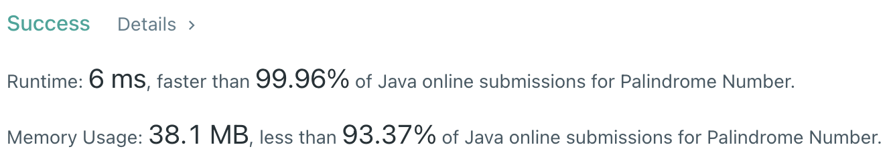

# Problem
[9. Palindrome Number](https://leetcode.com/problems/palindrome-number/)

# Performance



# Python
```Python
class Solution:
    def isPalindrome(self, x: int) -> bool:
        # (base case)
        if x <  0 or (x != 0 and x % 10 == 0): return False
        if x < 10: return True
        
        # ==================================================
        #  Math                                            =
        # ==================================================
        # time  : O(log(n))
        # space : O(1)
        
        rev = 0
        
        # loop until reversed integer > divided integer
        # - ex: 12321, rev = 123, x = 12
        # - ex: 9119,  rev = 91,  x = 91
        # - ex: 4321,  rev = 123, x = 4
        # - ex: 1234,  rev = 43,  x = 12
        while x > rev:
            pop = x % 10
            x //= 10
            
            rev = rev*10 + pop
        
        # for odd length, middle digit could be ignored by // 10
        if x == rev or x == rev // 10: return True
        else: return False
```

# Java
```Java
class Solution {
    /**
     * @time  : O(log(n))
     * @space : O(1)
     */
     
    public boolean isPalindrome(int x) {
        if(x < 0 || (x != 0 && x % 10 == 0)) return false;
        if(x < 10) return true;
        
        int rev = 0;
        
        while(x > rev) {
            rev = rev*10 + x % 10;;
            x /= 10;
        }
        
        if(x == rev || x == rev/10) return true;
        else return false;
    }
}
```