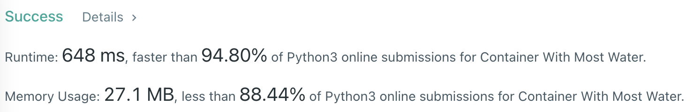

# Problem
[11. Container With Most Water](https://leetcode.com/problems/container-with-most-water/)

# Performance



# Python
```Python
class Solution:
    def maxArea(self, height: List[int]) -> int:
        # (base case)
        if len( height ) == 2: return min( height )
        
        # ==================================================
        #  Array + Two Pointer                             =
        # ==================================================
        # time  : O(n)
        # space : O(1)
        
        area = 0
        l, r = 0, len(height) - 1
        
        # start from both-side (due to the LARGEST gap)
        # move the pointer with SHORTER height
        while r > l:
            tmp = min(height[l], height[r]) * (r - l)
            if tmp > area: area = tmp
            
            if height[r] > height[l]: l += 1
            else: r -= 1
                
        return area
```

# Java
```Java
class Solution {
    /**
     * @time  : O(n)
     * @space : O(1)
     */
     
    public int maxArea(int[] height) {
        /* base case */
        if(height.length == 2) return Math.min(height[0], height[1]);
        
        int l = 0, r = height.length - 1;
        int area = 0;
            
        while(l < r) {
            int tmp = 0;
            
            if(height[l] < height[r]) {
                if(height[l] == 0) {
                    l += 1;
                    continue;
                }
                
                tmp = height[l] * (r - l);
                l += 1;
                
            } else {
                if(height[r] == 0) {
                    r -= 1;
                    continue;
                }
                
                tmp = height[r] * (r - l);
                r -= 1;
            }
            
            if(tmp > area) area = tmp;
        }
        
        return area;
    }
}
```
