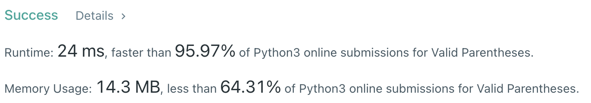
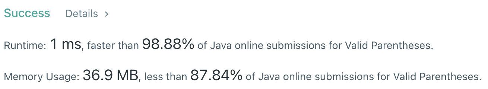

# Problem
[20. Valid Parentheses](https://leetcode.com/problems/valid-parentheses/)

# Performance



# Python
```Python
class Solution:
    def isValid(self, s: str) -> bool:
        # (base case)
        if len(s) == 1: return False
        
        # ==================================================
        #  String + Stack                                  =
        # ==================================================
        # time  : O(n)
        # space : O(n)
        
        table = { 
            ')': '(', 
            ']': '[', 
            '}': '{' 
        }
        stack = []
        
        if s[0] in table: return False
        
        for char in s:
            if char in table:
                # if stack is alread empty, return False
                if not stack: return False 
                
                item = stack.pop()
                
                if item != table[char]: return False
                
            else:
                stack.append( char )
                
        # check stack's capacity before returning True
        return not stack
```

# Java
```Java
class Solution {
    /**
     * @time  : O(n)
     * @space : O(n)
     */
     
    public boolean isValid(String s) {
        /* base case */
        if(s.length() == 1) return false;
        
        HashMap<Character, Character> table = new HashMap<Character, Character>();
        table.put( ')', '(' );
        table.put( '}', '{' );
        table.put( ']', '[' );
        
        if( table.containsKey( s.charAt(0) ) ) return false;
        
        Stack<Character> stack = new Stack<Character>();
        
        for(int i=0 ; i<s.length() ; i++) {
            char c = s.charAt(i);
            
            if(table.containsKey(c)){
                if(stack.isEmpty()) return false;
                
                char top = stack.pop();
                
                if(top != table.get(c)) return false;
                
            } else{
                stack.push(c);
            }
        }
        
        return stack.isEmpty();
    }
}
```
