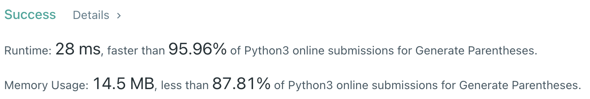

# Problem
[22. Generate Parentheses](https://leetcode.com/problems/generate-parentheses/)

# Performance


# Python
```Python
class Solution:
    def generateParenthesis(self, n: int) -> List[str]:
        
        # ==================================================
        #  Dynamic Programming                             =
        # ==================================================
    
        dp = {1: set(['()']), 2: set(['(())', '()()'])}
        
        # (base case)
        if n == 1 or n == 2: return dp[n]
        
        for i in range(3, n+1):
            # pattern 1: outer parenthese + subproblem with length - 1
            dp[i] = set(['(' + x + ')' for x in dp[i-1]])
            
            # pattern 2: dp[i] is formed by dp[j] + dp[i-j]
            for j in range(1, i):
                # perform set union on combinations of elements in dp[j] and dp[i-j]
                dp[i] |= set([x + y for x in dp[j] for y in dp[i-j]])
        
        return list(dp[n])
```

```Python
class Solution:
    def generateParenthesis(self, n: int) -> List[str]:
        # (base case)
        if n == 1: return ['()']
        
        # ==================================================
        #  String + Set                                    =
        # ==================================================
        
        ans = ['()']
        
        for _ in range(n-1):
            result = set()

            # insert '()' in each index of string
            # then using SET JOIN to combine without duplicate items
            for string in ans : result |= self.insertParenthesis( string )

            ans = result

        return ans
    
    def insertParenthesis(self, string) -> set:        
        ret = set()
        for i in range(len(string)) : ret.add(string[:i] + '()' + string[i:])
        return ret
```