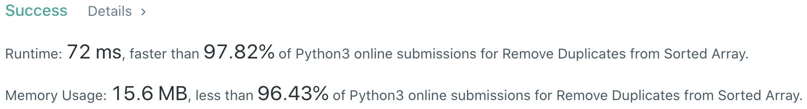

# Problem
[26. Remove Duplicates from Sorted Array](https://leetcode.com/problems/remove-duplicates-from-sorted-array/)

# Performance


# Python
```python3
class Solution:
    def removeDuplicates(self, nums: List[int]) -> int:
        #:  (edge case)
        if len(nums) == 0 or len(nums) == 1: return len(nums)
        
        # ==================================================
        #  Array + Two Pointer                             =
        # ==================================================
        # time  : O(n)
        # space : O(1)
        
        slowP, fastP = 0, 0
        
        while fastP < len(nums):
            if nums[fastP] != nums[slowP]:
                slowP += 1
                nums[slowP] = nums[fastP]
                
            fastP += 1
                
        return slowP+1
```

# Java
```Java
class Solution {
    /**
     * @time  : O(n)
     * @space : O(1)
     */
    public int removeDuplicates(int[] nums) {
        if( nums.length == 0 || nums.length == 1 ) return nums.length;
        
        int slowP = 0, fastP = 0;
        
        while( fastP < nums.length ){
            if( nums[slowP] != nums[fastP] ){
                nums[++slowP] = nums[fastP];
            }
            
            fastP++;
        }
        
        return ++slowP;
    }
}
```
