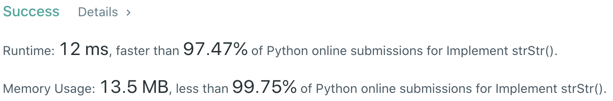

# Problem
[28. Implement strStr()](https://leetcode.com/problems/implement-strstr)

# Performance


# Reference
[KMP Algorithm Explanation](https://www.youtube.com/watch?v=GTJr8OvyEVQ)

# Python
```Python3
class Solution:
    def strStr(self, haystack: str, needle: str) -> int:
        #:  (edge case)
        if not needle: return 0
        if not haystack: return -1
        if len(needle) > len(haystack): return -1
        
        # ==================================================
        #  String + Two Pointer                            =
        # ==================================================
        # time  : O(n)
        # space : O(1)        
        
        start, end = 0, len(needle)
        
        while end-1 < len(haystack):
            if haystack[start:end] == needle: return start
            else:
                start += 1
                end   += 1
            
        return -1
```

<br>

```Python3
class Solution:
    def strStr(self, haystack: str, needle: str) -> int:
        #:  (edge case)
        if not needle: return 0
        if not haystack: return -1
        if len(needle) > len(haystack): return -1
        
        # ==================================================
        #  KMP Pattern Matching (Substring Search)         =
        # ==================================================
        # time  : O(n)
        # space : O(n)
```

# Java
```Java
class Solution {
    /**
     * @time  : O(n)
     * @space : O(1)
     */
    public int strStr(String haystack, String needle) {
        if( needle.length() == 0 ) return 0;
        if( haystack.length() == 0 || needle.length() > haystack.length() ) return -1;
        
        int start = 0, end = needle.length();
        
        while( end-1 < haystack.length() ){
            if( haystack.substring( start, end ).equals( needle ) ){ 
                return start;
                
            } else{
                start++;
                end++;
            }
            
        }
        
        return -1;
    }
}
```
