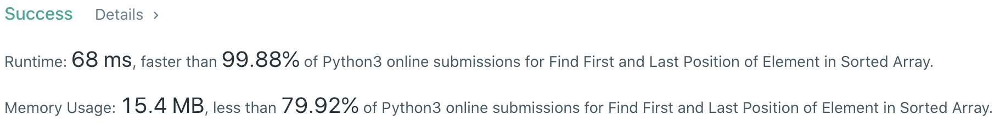
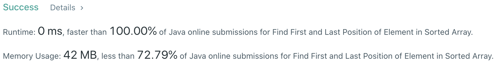

# Problem
[34. Find First and Last Position of Element in Sorted Array](https://leetcode.com/problems/find-first-and-last-position-of-element-in-sorted-array)

# Performance



# Python
```Python3
class Solution:
    def searchRange(self, nums: List[int], target: int) -> List[int]:
        #: (base case)
        if not nums or (len(nums) == 1 and nums[0] != target): return [-1, -1]
        
        # ==================================================
        #  Array + Binary Search                           =
        # ==================================================
        # time  : O(log(n))
        # space : O(1)
        
        start, end = 0, 0
        
        #: find the starting position (left-most element)
        l, r = 0, len(nums) - 1
        while l <= r:
            mid = (l + r) // 2
            
            if nums[mid] >= target: r = mid - 1
            else: l = mid + 1
                
        start = l
        
        #: find the ending position (right-most element)
        l, r = 0, len(nums) - 1
        while l <= r:
            mid = (l + r) // 2
            
            if nums[mid] <= target: l = mid + 1
            else: r = mid - 1
                
        end = r
        
        if start > end: return [-1, -1]
        return [start, end]
```

# Java
```Java
class Solution {
    /**
     * @time  : O(log(n))
     * @space : O(1)
     */
    
    public int[] searchRange(int[] nums, int target) {
        /* base case */
        if(nums.length == 0) return new int[]{-1, -1};
        
        int start = 0, end = 0;
        
        /* starting position (left-most element) */
        int l = 0, r = nums.length - 1;
        while(l <= r){
            int mid = (l + r) / 2;
            
            if(nums[mid] >= target) r = mid - 1;
            else l = mid + 1;
        }
        
        start = l;
        
        /* ending position (right-most element) */
        l = 0;
        r = nums.length - 1;
        while(l <= r){
            int mid = (l + r) / 2;
            
            if(nums[mid] <= target) l = mid + 1;
            else r = mid - 1;
        }
        
        end = r;
        
        if(start > end) return new int[]{-1, -1};
        return new int[]{start, end};
    }
}
```
