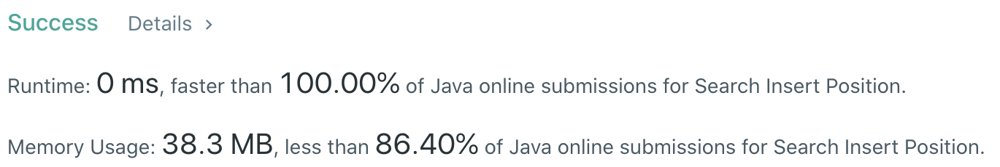

# Problem
[35. Search Insert Position](https://leetcode.com/problems/search-insert-position/)

# Performance



# Python
```Python
class Solution:
    def searchInsert(self, nums: List[int], target: int) -> int:
        # (base case)
        if len(nums) == 1: return 0 if nums[0] >= target else 1
        
        # ==================================================
        #  Array + Binary Search                           =
        # ==================================================
        # time  : O(log(n))
        # space : O(1)
        
        l, r = 0, len(nums)
        while l < r:
            mid = (l + r) // 2
            
            if nums[mid] == target: return mid
            elif nums[mid] > target: r = mid
            elif nums[mid] < target: l = mid + 1
                
        return l
```

# Java
```Java
class Solution {
    /**
     * @time  : O(log(n))
     * @space : O(1)
     */
    
    public int searchInsert(int[] nums, int target) {
        /* base case */
        if(nums.length == 1) return (nums[0] >= target) ? 0 : 1;
        
        int l = 0, r = nums.length;
        while(l < r) {
            int mid = (l + r) / 2;
            
            if(nums[mid] == target) return mid;
            else if(nums[mid] > target) r = mid;
            else if(nums[mid] < target) l = mid + 1;
        }
        
        return l;
    }
}
```