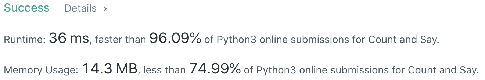
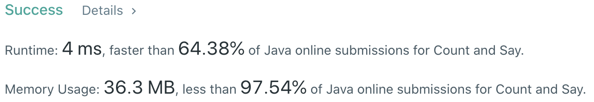

# Problem
[38. Count and Say](https://leetcode.com/problems/count-and-say/)

# Performance



# Python
```python3
class Solution:
    def countAndSay(self, n: int) -> str:
        # (base case)
        if n == 1: return '1'
        
        # ==================================================
        #  String + Math                                   =
        # ==================================================
        # time  : O(nk)
        # space : O(1)
        
        ret = '1'
        
        for _ in range(n - 1):
            prev, counter = ret[0], 0
            tmp = ''
            
            for c in ret:
                if prev != c:
                    tmp += str(counter) + prev
                    prev, counter = c, 1
                else:
                    counter += 1
                    
            tmp += str(counter) + prev
            ret = tmp
            
        return ret
```

# Java
```Java
class Solution {
    /**  
     * @time  : O(nk)
     * @space : O(1)
     */

    public String countAndSay(int n) {
        String ret = "1";
        
        /* base case */
        if(n == 1) return ret;
        
        for(int i=0 ; i<n-1 ; i++) {
            StringBuilder tmp = new StringBuilder();
            char prev = ret.charAt(0);
            int counter = 0;
            
            for(int j=0 ; j<ret.length() ; j++) {
                if(prev != ret.charAt(j)) {
                    tmp.append(counter);
                    tmp.append(prev);
                    prev = ret.charAt(j);
                    counter = 1;
                } else {
                    counter++;
                }
            }
            
            tmp.append(counter);
            tmp.append(prev);
            ret = tmp.toString();
        }
        
        return ret;
    }
}
```