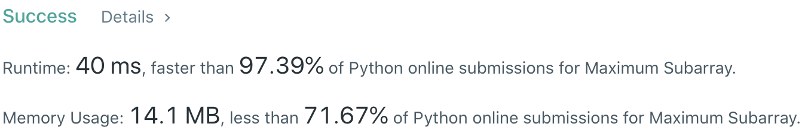
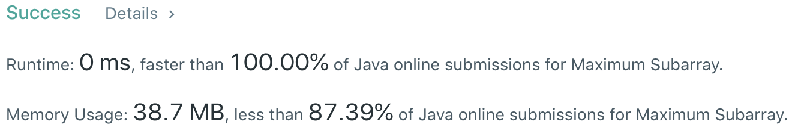

# Problem
[53. Maximum Subarray](https://leetcode.com/problems/maximum-subarray)

# Performance



# Python
```Python
class Solution:
    def maxSubArray(self, nums: List[int]) -> int:
        # (base case)
        if len(nums) == 1: return nums[0]
        
        # ==================================================
        #  Array + Dynamic Programming                     =
        # ==================================================
        # time  : O(n)
        # space : O(1)
        
        curSum = maxSum = nums[0]
        
        for i in range(1, len(nums)):
            curSum = max(nums[i], curSum + nums[i])
            maxSum = max(curSum, maxSum)

        return maxSum
```

```Python
class Solution:
    def maxSubArray(self, nums: List[int]) -> int:
        #: (edge case)
        if len(nums) == 1: return nums[0]
        
        # ==================================================
        #  Array + Dynamic Programming + Greedy            =
        # ==================================================
        # time  : O(n)
        # space : O(n)
        
        dp = [None] * len(nums)
        dp[0] = nums[0]
        
        for i in range(1, len(nums)):
            ##  to determine local MAX, choose between accumulating or restart at the next number
            ##  - (example) [-2, 1, 2], it is clear that sum of (-2+1) is smaller than '1'
            ##                          so restart at '1' would be the next action
            dp[i] = max(nums[i], dp[i-1] + nums[i])
            
        return max(dp)
```

# Java
```Java
class Solution {
    /**
     * @time  : O(n)
     * @space : O(1)
     */

    public int maxSubArray(int[] nums) {
        /* base case */
        if(nums.length == 1) return nums[0];
    
        int curSum = nums[0], maxSum = nums[0];
        
        for(int i=1 ; i<nums.length ; i++){
            curSum = Math.max(nums[i], curSum + nums[i]);
            maxSum = Math.max(curSum, maxSum);
        }
        
        return maxSum;
    }
}
```
