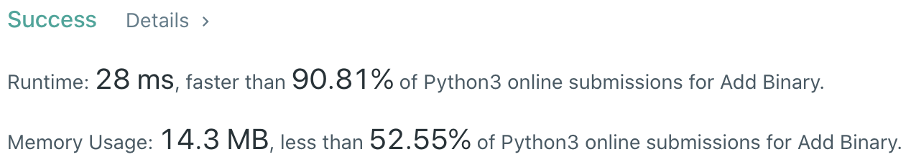
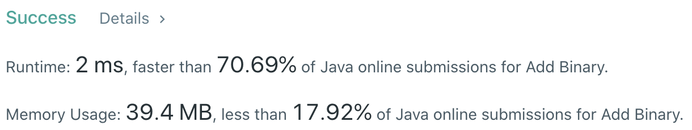

# Problem
[67. Add Binary](https://leetcode.com/problems/add-binary/)

# Performance



# Python
```Python
class Solution:
    def addBinary(self, a: str, b: str) -> str:
        
        # ==================================================
        #  String + Math                                   =
        # ==================================================
        # time  : O(max(n,m))
        # space : O(1)
        
        ans = ''
        n1, n2, carry = len(a) - 1, len(b) - 1, 0
        
        while n1 >= 0 or n2 >= 0:
            bit1 = int(a[n1]) if n1 >= 0 else 0
            bit2 = int(b[n2]) if n2 >= 0 else 0
            
            result = bit1 + bit2 + carry
            if result > 1:
                result -= 2
                carry = 1
            else:
                carry = 0
                
            ans = str(result) + ans
            
            n1 -= 1
            n2 -= 1
            
        if carry: ans = '1' + ans
        return ans
```

# Java
```Java
class Solution {
    /**
     * @time  : O(max(m,n))
     * @space : O(1)
     */
    
    public String addBinary(String a, String b) {
        int n1 = a.length() - 1, n2 = b.length() - 1, carry = 0;
        StringBuilder ans = new StringBuilder();
        
        while(n1 >= 0 || n2 >= 0) {
            int bit1 = (n1 >= 0) ? a.charAt(n1) - '0' : 0;
            int bit2 = (n2 >= 0) ? b.charAt(n2) - '0' : 0;
            
            int sum = bit1 + bit2 + carry;
            if(sum > 1) {
                sum -= 2;
                carry = 1;
            } else {
                carry = 0;
            }
            
            ans.append(sum);
            
            n1--;
            n2--;
        }
        
        if(carry != 0) ans.append(carry);
        return ans.reverse().toString();
    }
}
```