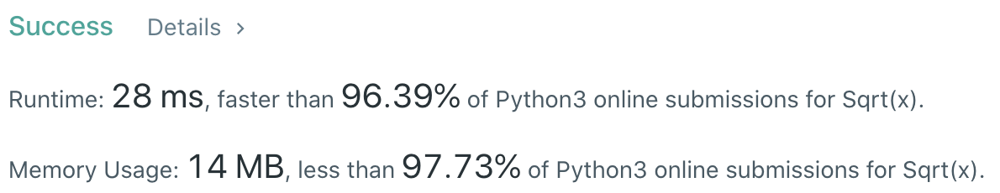

# Problem
[69. Sqrt(x)](https://leetcode.com/problems/sqrtx)

# Performance



# Python
```Python
class Solution:
    def mySqrt(self, x: int) -> int:
        # (base case)
        if x == 0: return 0
        if x < 4: return 1
        
        # ==================================================
        #  Binary Search + Math                            =
        # ==================================================
        # time  : O(log(n))
        # space : O(1)
        
        l, r = 1, x
        
        while l < r:
            mid = (l + r) // 2
            num = mid * mid
            
            if num == x: return mid
            elif num > x: r = mid
            elif num < x: l = mid + 1
                
        return l - 1
```

# Java
```Java
class Solution {
    /**
     * @time  : O(log(n))
     * @space : O(1)
     */

    public int mySqrt(int x) {
        /* base case */
        if( x == 0 ) return 0;
        if( x  < 4 ) return 1;
        if( x == 4 ) return 2;
        
        int l = 1, r = x;
        
        while(l < r){
            int mid = l + (r - l) / 2;
            
            // use LONG since mid * mid can be larger than INT.MAX
            long num = (long) mid * mid;
            
            if(num == x) return mid;
            else if(num > x) r = mid;
            else if(num < x) l = mid + 1;
        }
        
        return l - 1;
    }
}
```