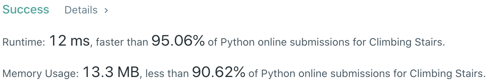

# Problem
[70. Climbing Stairs](https://leetcode.com/problems/climbing-stairs)

# Performance


# Python
```Python3
class Solution:
    def climbStairs(self, n: int) -> int:
        #: (base case) <4: 1, 2, 3
        if n < 4: return n
        
        # ==================================================
        #  Dynamic Programming                             =
        # ==================================================
        # time  : O(n)
        # space : O(n)
        
        dp = [1, 2, 3] + [None] * (n-3)
        for i in range( 3, n ):
            dp[i] = dp[i-1] + dp[i-2]
            
        return dp[-1]
```

```Python3
class Solution:
    def climbStairs(self, n: int) -> int:
        #: (base case) <4: 1, 2, 3
        if n < 4: return n
        
        # ==================================================
        #  Dynamic Programming                             =
        # ==================================================
        # time  : O(n)
        # space : O(1)
        
        first, second = 2, 3
        for i in range( 3, n ):
            tmp = first
            first = second
            second += tmp
            
        return second
```

# Java
```Java
class Solution {
    /**
     * @time  : O(n)
     * @space : O(1)
     */
    public int climbStairs(int n) {
        if( n < 4 ) return n;
        
        int first = 2, second = 3;
        for( int i=3 ; i<n ; i++ ){
            int tmp = first;
            first = second;
            second += tmp;
        }
        
        return second;
    }
}
```
