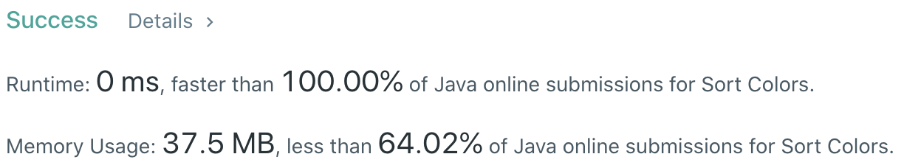

# Problem
[75. Sort Colors](https://leetcode.com/problems/sort-colors)

# Performance



# Python
```Python
class Solution:
    def sortColors(self, nums: List[int]) -> None:
        """
        Do not return anything, modify nums in-place instead.
        """
        # (base case)
        if len(nums) == 1: return
        
        # ==================================================
        #  Array + Three Pointers                          =
        # ==================================================
        # time  : O(n)
        # space : O(1)
        
        p0, p2 = 0, len(nums) - 1
        
        # (optimization)
        while p0 < len(nums) and nums[p0] == 0: p0 += 1
        if p0 == len(nums): return 
        
        while p2 >= 0 and nums[p2] == 2: p2 -= 1
        if p2 == 0: return
        
        moveP = p0
        
        while moveP <= p2:
            if nums[moveP] == 0:
                nums[p0], nums[moveP] = nums[moveP], nums[p0]
                p0 += 1
                moveP += 1
                
            elif nums[moveP] == 1:
                moveP += 1
                
            elif nums[moveP] == 2:
                nums[p2], nums[moveP] = nums[moveP], nums[p2]
                p2 -= 1
```

# Java
```Java
class Solution {
    /**
     * @time  : O(n)
     * @space : O(1)
     */

    public void sortColors(int[] nums) {
        /* base case */
        if(nums.length == 1) return;
        
        int p0 = 0, p2 = nums.length - 1;
        
        while(p0 < p2 && nums[p0] == 0) p0++;
        if(p0 == p2) return;
            
        while(p2 <= 0 && nums[p2] == 2) p2--;
        if(p2 == 0) return;
            
        int moveP = p0;
        
        while(moveP <= p2) {
            if(nums[moveP] == 0) {
                int tmp = nums[p0];
                nums[p0] = nums[moveP];
                nums[moveP] = tmp;
                
                moveP++;
                p0++;
            } else if(nums[moveP] == 2) {
                int tmp = nums[p2];
                nums[p2] = nums[moveP];
                nums[moveP] = tmp;
                
                p2--;
            } else {
                moveP++;
            }
        }
    }
}
```
