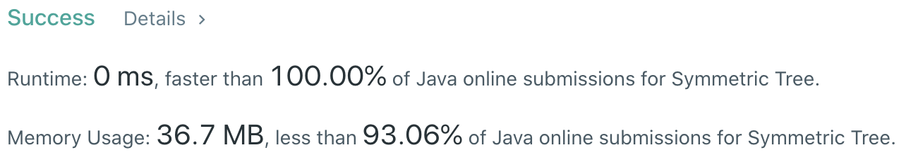

# Problem
[101. Symmetric Tree](https://leetcode.com/problems/symmetric-tree)

# Performance



# Python
```Python
class Solution:
    def isSymmetric(self, root: TreeNode) -> bool:
        # (base case)
        if not root.left and not root.right: return True
        
        # ==================================================
        #  Tree                               (Recursive)  =
        # ==================================================
        # time  : O(n)
        # space : O(n)
        
        def isMirror(leftNode, rightNode):
            if not leftNode and not rightNode: return True
            if not leftNode or  not rightNode: return False
            
            return (leftNode.val == rightNode.val)              \
                and isMirror(leftNode.left,  rightNode.right)   \
                and isMirror(leftNode.right, rightNode.left)
        
        return isMirror(root.left, root.right)
```

```Python
class Solution:
    def isSymmetric(self, root: TreeNode) -> bool:
        # (base case)
        if not root.left and not root.right: return True
        
        # ==================================================
        #  Tree                               (Iterative)  =
        # ==================================================
        # time  : O(n)
        # space : O(n)
        
        stack = [(root.left, root.right)]
        while stack:
            node1, node2 = stack.pop()
            
            # no child nodes, continue instead of pushing null nodes
            if not (node1  or node2): continue
                
            if not (node1 and node2): return False
            if node1.val != node2.val: return False
            
            stack.append((node1.left,  node2.right))
            stack.append((node1.right, node2.left))
            
        return True
```

# Java
```Java
class Solution {
    /**
     * @time  : O(n)
     * @space : O(n)
     */
    
    public boolean isMirror(TreeNode node1, TreeNode node2) {
        if(node1 == null && node2 == null) return true;
        if(node1 == null || node2 == null) return false;
        
        return (node1.val == node2.val) && 
               isMirror(node1.left,  node2.right) &&
               isMirror(node1.right, node2.left);
    }
    
    public boolean isSymmetric(TreeNode root) {
        /* base case */
        if(root.left == null && root.right == null) return true;
        
        return isMirror(root.left, root.right);
    }
}
```
