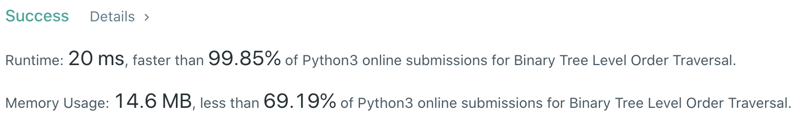

# Problem
[102. Binary Tree Level Order Traversal](https://leetcode.com/problems/binary-tree-level-order-traversal/)

# Performance



# Python
```python
class Solution:
    def levelOrder(self, root: TreeNode) -> List[List[int]]:
        # (base case)
        if not root: return []
        if not root.left and not root.right: return [[root.val]]
        
        # ==================================================
        #  Binary Tree + Level Order Traversal             =
        # ==================================================
        # time  : O(n)
        # space : O(n)
        
        ans = []
        stack = [root]
        
        while stack:
            tmp = []
            for i in range(len(stack)):
                node = stack.pop(0)
                tmp.append(node.val)
                
                if node.left: stack.append(node.left)
                if node.right: stack.append(node.right)
                    
            ans.append(tmp)
                    
        return ans
```

```python
class Solution:
    def levelOrder(self, root: TreeNode) -> List[List[int]]:
        # (base case)
        if not root: return []
        if not root.left and not root.right: return [[root.val]]

        # ===================================================
        #  Binary Tree + Level Order Traversal (Recursive)  =
        # ===================================================
        # time  : O(n)
        # space : O(n)
        
        ans = []
        
        def recursive(node: TreeNode, depth: int) -> None:
            if len(ans) == depth: ans.append([])
            ans[depth].append(node.val)
            
            if node.left: recursive(node.left, depth + 1)
            if node.right: recursive(node.right, depth + 1)
        
        recursive(root, 0)
        return ans
```

# Java
```Java
class Solution {
    /**
     * @time  : O(n)
     * @space : O(n)
     */
    
    public List<List<Integer>> levelOrder(TreeNode root) {
        /* base case */
        if(root == null) return new ArrayList<>();
        
        List<List<Integer>> result = new ArrayList<List<Integer>>();
        Queue<TreeNode> queue = new LinkedList<TreeNode>();
        queue.add(root);
        
        while(!queue.isEmpty()) {
            List<Integer> tmp = new ArrayList<Integer>();
            int size = queue.size();
            for(int i=0; i<size ; i++) {
                TreeNode node = queue.remove();
                tmp.add(node.val);
                
                if(node.left != null) queue.add(node.left);
                if(node.right != null) queue.add(node.right);
            }
            
            result.add(tmp);
        }
        
        return result;
    }
}
```