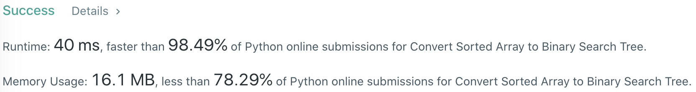
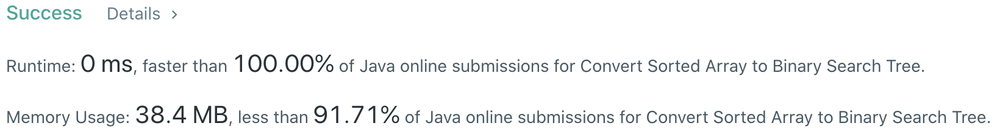

# Problem
[108. Convert Sorted Array to Binary Search Tree](https://leetcode.com/problems/convert-sorted-array-to-binary-search-tree)

# Performance



# Python
```Python3
class Solution:
    def sortedArrayToBST(self, nums: List[int]) -> TreeNode:
        # (base case)
        if len(nums) == 1: return TreeNode(nums[0])
        if len(nums) == 2: return TreeNode(nums[0], None, TreeNode(nums[1]))
        
        # ==================================================
        #  Binary Search Tree + Inorder Traversal          =
        # ==================================================
        # time  : O(n)
        # space : O(n)
        
        self.nums = nums
        return self.subTree(0, len(nums) - 1)
        
    def subTree(self, start: int, end: int) -> TreeNode:
        if start  > end: return None
        if start == end: return TreeNode(self.nums[start])
        
        mid = (start + end) // 2
        
        node = TreeNode(self.nums[mid])
        node.left  = self.subTree(start, mid - 1)
        node.right = self.subTree(mid + 1, end)
        
        return node
```

# Java
```Java
class Solution {
    /**
     * @time  : O(n)
     * @space : O(n)
     */
    
    int[] nums;
    
    public TreeNode subTree(int start, int end) {
        if(start  > end) return null;
        if(start == end) return new TreeNode(nums[start]);
            
        int center = (start + end) / 2;
        
        TreeNode node = new TreeNode(nums[center]);
        node.left  = subTree(start, center - 1);
        node.right = subTree(center + 1, end);
        
        return node;
    }
    
    public TreeNode sortedArrayToBST(int[] nums) {
        /* base case */
        if(nums.length == 1) return new TreeNode(nums[0]);
        
        this.nums = nums;
        
        return subTree(0, nums.length - 1);
    }
}
```