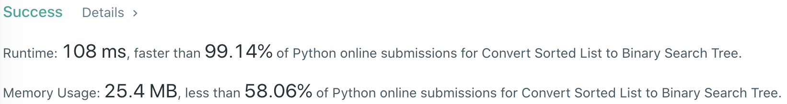
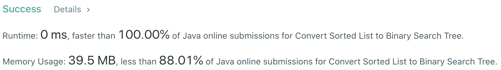

# Problem
[109. Convert Sorted List to Binary Search Tree](https://leetcode.com/problems/convert-sorted-list-to-binary-search-tree)

# Performance



# Python
```Python3
class Solution:
    def sortedListToBST(self, head: ListNode) -> TreeNode:
        #: (base case)
        if not head: return None
        if not head.next: return TreeNode(head.val)
        
        # ==================================================
        #  Linked List + Tree + DFS + Recursion            =
        # ==================================================
        # time  : O(nlog(n))
        # space : O(log(n)) due to height-balanced BST
        
        def findMid(node) -> TreeNode:
            prevP, slowP, fastP = None, node, node
            
            while fastP and fastP.next:
                prevP = slowP
                slowP = slowP.next
                fastP = fastP.next.next
            
            #: DISCONNECT the left half from the mid node.
            if prevP: prevP.next = None
                
            return slowP
            
        mid  = findMid(head)
        
        node       = TreeNode(mid.val)
        node.left  = self.sortedListToBST(head)
        node.right = self.sortedListToBST(mid.next)
        
        return node
```

```Python3
class Solution:
    def sortedListToBST(self, head: ListNode) -> TreeNode:
        #: (base case)
        if not head: return None
        if not head.next: return TreeNode(head.val)
        
        # ==================================================
        #  Linked List + Tree + In-order Recursion         =
        # ==================================================
        # time  : O(n)
        # space : O(log(n)) due to height-balanced BST
        
        #: (find size)
        size = 0
        tmp  = head
        while tmp:
            size += 1
            tmp = tmp.next
        
        def subTree(left, right) -> TreeNode:
            nonlocal head
            
            if left  > right: return None
            
            mid = (left + right) // 2
            left = subTree(left, mid - 1)
            
            node = TreeNode(head.val)
            node.left = left
            head = head.next
            
            node.right = subTree(mid + 1, right)
            
            return node
            
        return subTree(0, size - 1)
```

# Java
```Java
class Solution {
    /**
     * @time  : O(nlog(n))
     * @space : O(log(n)) due to height-balanced BST
     */
    public ListNode findMid(ListNode head) {
        ListNode prevP = null, slowP = head, fastP = head;
        
        while(fastP != null && fastP.next != null) {
            prevP = slowP;
            slowP = slowP.next;
            fastP = fastP.next.next;
        }
        
        if(prevP != null) prevP.next = null;
        return slowP;
    }
    
    public TreeNode sortedListToBST(ListNode head) {
        /* base case */
        if(head == null) return null;
        if(head.next == null) return new TreeNode(head.val);
        
        ListNode mid = findMid(head);
        
        TreeNode node = new TreeNode(mid.val);
        node.left     = sortedListToBST(head);
        node.right    = sortedListToBST(mid.next);
        
        return node;
    }
}
```
