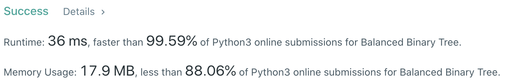
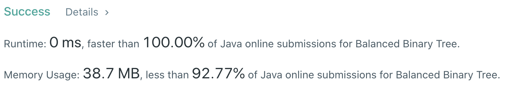

# Problem
[110. Balanced Binary Tree](https://leetcode.com/problems/balanced-binary-tree/)

# Performance



# Python
```python
class Solution:
    def isBalanced(self, root: TreeNode) -> bool:
        # (base case)
        if not root: return True
        if not root.left and not root.right: return True
            
        # ==================================================
        #  Binary Tree + DFS                  (Bottom-up)  =
        # ==================================================
        # time  : O(n)
        # space : O(n)
        
        return self.dfs(root) != -1
    
    def dfs(self, node: TreeNode) -> bool:
        if not node: return 0
        if not node.left and not node.right: return 1
        
        leftH = self.dfs(node.left)
        if leftH == -1: return -1
        
        rightH = self.dfs(node.right)
        if rightH == -1: return -1
        
        if abs(leftH - rightH) > 1: return -1
        return max(leftH, rightH) + 1
```

```python
class Solution:
    def isBalanced(self, root: TreeNode) -> bool:
        # (base case)
        if not root: return True
        if not root.left and not root.right: return True
        
        # ==================================================
        #  Binary Tree                         (Top-down)  =
        # ==================================================
        # time  : O(nlog(n))
        # space : O(n)
            
        return abs(self.getHeight(root.left) - self.getHeight(root.right)) < 2 \
            and self.isBalanced(root.left) \
            and self.isBalanced(root.right)
            
    def getHeight(self, root) -> int:
        if not root: return 0
        if not root.left and not root.right: return 1
        
        return max(self.getHeight(root.left), self.getHeight(root.right)) + 1
```

# Java
```Java
class Solution {
    /**  
     * @time  : O(n)
     * @space : O(n)
     */
    
    public boolean isBalanced(TreeNode root) {
        /* base case */
        if(root == null) return true;
        if(root.left == null && root.right == null) return true;
        
        return (dfs(root) != -1) ? true : false;
    }
    
    public int dfs(TreeNode root) {
        if(root == null) return 0;
        if(root.left == null && root.right == null) return 1;
        
        int leftH = dfs(root.left);
        if(leftH == -1) return -1;
        
        int rightH = dfs(root.right);
        if(rightH == -1) return -1;
        
        if(Math.abs(leftH - rightH) > 1) return -1;
        return Math.max(leftH, rightH) + 1;
    }
}
```