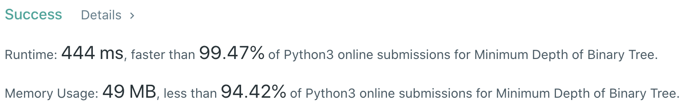
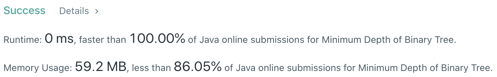

# Problem
[111. Minimum Depth of Binary Tree](https://leetcode.com/problems/minimum-depth-of-binary-tree/)

# Performance



# Python
```python
class Solution:
    def minDepth(self, root: TreeNode) -> int:
        # (base case)
        if not root: return 0
        if not root.left and not root.right: return 1
        
        # ==================================================
        #  Binary Tree + Level Order Traversal             =
        # ==================================================
        # time  : O(n)
        # space : O(n), O(log(n)) for average case

        minDepth = 0
        stack = [root]
        
        while stack:
            # loop through stack for current length, pop the first node
            for i in range(len(stack)):
                node = stack.pop(0)
                
                if not node.left and not node.right: return minDepth + 1
                
                if node.left: stack.append(node.left)
                if node.right: stack.append(node.right)
                    
            minDepth += 1
            
        return minDepth
```

# Java
```Java
class Solution {
    /**  
     * @time  : O(n)
     * @space : O(n), O(log(n)) for average case
     */
    
    public int minDepth(TreeNode root) {
        /* base case */
        if(root == null) return 0;
        if(root.left == null && root.right == null) return 1;
        
        int depth = 0;
        Queue<TreeNode> queue = new LinkedList<>();
        queue.add(root);
        
        while(!queue.isEmpty()) {
            int size = queue.size();
            for(int i=0 ; i<size ; i++) {
                TreeNode node = queue.remove();
                
                if(node.left == null && node.right == null) return depth + 1;
                
                if(node.left != null) queue.add(node.left);
                if(node.right != null) queue.add(node.right);
            }
            
            depth++;
        }
        
        return depth;
    }
}
```