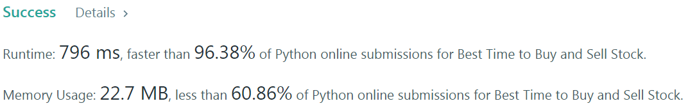
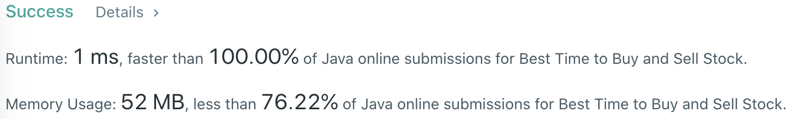

# Problem
[121. Best Time to Buy and Sell Stock](https://leetcode.com/problems/best-time-to-buy-and-sell-stock)

# Performance



# Python
```Python3
class Solution:
    def maxProfit(self, prices: List[int]) -> int:
        #  (base case)
        if len(prices) == 1: return 0
        
        # ==================================================
        #  Array + Dynamic Programming         (localMin)  =
        # ==================================================
        # time  : O(n)
        # space : O(1)
        
        localMin, maxProfit = float('inf'), float('-inf')
        for i in range(len(prices)):
            if prices[i] < localMin: localMin = prices[i]
                
            tmpProfit = prices[i] - localMin
            if tmpProfit > maxProfit: maxProfit = tmpProfit
                
        return maxProfit
```

```Python3
class Solution:
    def maxProfit(self, prices: List[int]) -> int:
        #  (base case)
        if len(prices) == 1: return 0
        
        # ==================================================
        #  Array + Dynamic Programming         (localMax)  =
        # ==================================================
        # time  : O(n)
        # space : O(1)
        
        localMax, maxProfit = float('-inf'), float('-inf')
        for i in range(len(prices)-1, -1, -1):
            if prices[i] > localMax: localMax = prices[i]
            
            tmpProfit = localMax - prices[i]
            if tmpProfit > maxProfit: maxProfit = tmpProfit
                
        return maxProfit
```

```Python3
class Solution:
    def maxProfit(self, prices: List[int]) -> int:
        #  (base case)
        if len(prices) == 1: return 0
        
        # ==================================================
        #  Array + Dynamic Programming              (FSM)  =
        # ==================================================
        # time  : O(n)
        # space : O(1)
        
        hold, noHold = float('-inf'), 0
        
        for element in prices:
            preHold, preNoHold = hold, noHold
            
            #  HOLD    state - (1) no transaction in HOLD state    (2) BUY at NO HOLD state
            #  [Note] NO HOLD state has no profit since only allow one transaction
            hold   = max(preHold,   0         - element)
            
            #  NO HOLD state - (1) no transaction in NO HOLD state (2) SELL at HOLD state
            noHold = max(preNoHold, preHold   + element)
        
        #  (HOLD state does not have MAX profit)
        return noHold
```

# Java
```Java
class Solution {
    /**
     * @time  : O(n)
     * @space : O(1)
     */
     
    public int maxProfit(int[] prices) {
        /* base case */
        if(prices.length == 1) return 0;
        
        int localMin = Integer.MAX_VALUE, maxProfit = Integer.MIN_VALUE;
        for(int i=0 ; i<prices.length ; i++) {
            if(prices[i] < localMin) localMin = prices[i];
                
            int tmpProfit = prices[i] - localMin;
            if(tmpProfit > maxProfit) maxProfit = tmpProfit;
        }
        
        return maxProfit;
    }
}
```
