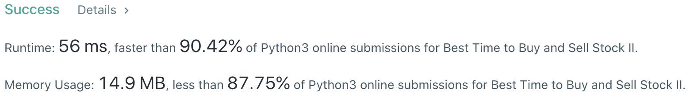

# Problem
[122. Best Time to Buy and Sell Stock II](https://leetcode.com/problems/best-time-to-buy-and-sell-stock-ii/)

# Performance



# Python
```Python
class Solution:
    def maxProfit(self, prices: List[int]) -> int:
        #  (base case)
        if len(prices) == 1: return 0
        
        # ==================================================
        #  Dynamic Programming                             =
        # ==================================================
        # time  : O(n)
        # space : O(1)
        
        hold, noHold = float('-inf'), 0
        
        for element in prices:
            preHold, preNoHold = hold, noHold
            
            #  HOLD    state - (1) no transaction in HOLD state    (2) BUY at NO HOLD state
            hold   = max(preHold,   preNoHold - element)
            
            #  NO HOLD state - (1) no transaction in NO HOLD state (2) SELL at HOLD state
            noHold = max(preNoHold, preHold   + element)
        
        #  (HOLD state does not have MAX profit)
        return noHold
```

```Python
class Solution:
    def maxProfit(self, prices: List[int]) -> int:
        #  (base case)
        if len(prices) == 1: return 0
        
        # ==================================================
        #  Greedy                                          =
        # ==================================================
        # time  : O(n)
        # space : O(1)
        
        profit = 0
        
        for i in range(1, len(prices)):
            tmpProfit = prices[i] - prices[i-1]
            if tmpProfit > 0: profit += tmpProfit
                
        return profit
```

# Java
```Java
class Solution {
    /**
     * @time  : O(n)
     * @space : O(1)
     * 
     * Greedy Method
     */
    
    public int maxProfit(int[] prices) {
        /* base case */
        if(prices.length == 1) return 0;
        
        int profit = 0;
        
        for( int i=1 ; i<prices.length ; i++) {
            int tmpProfit = prices[i] - prices[i-1];
            if(tmpProfit > 0) profit += tmpProfit;
        }
        
        return profit;
    }
}
```
