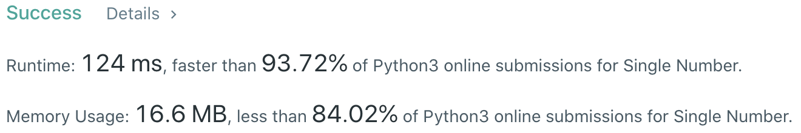

# Problem
[136. Single Number](https://leetcode.com/problems/single-number)

# Performance



# Python
```Python
class Solution:
    def singleNumber(self, nums: List[int]) -> int:
        # (base case)
        if len(nums) == 1: return nums[0]
        
        # ==================================================
        #  Bit Manipulation                                =
        # ==================================================
        # time  : O(n)
        # space : O(1)
        
        # 0^a = a so the initial value of ret can be 0
        ret = 0
        for num in nums: ret ^= num
        return ret
```

```Python
class Solution:
    def singleNumber(self, nums: List[int]) -> int:
        # (base case)
        if len(nums) == 1: return nums[0]
        
        # ==================================================
        #  Python Set                                      =
        # ==================================================
        # time  : O(n)
        # space : O(n)
        
        record = set()
        for num in nums:
            if num in record: record.remove(num)
            else: record.add(num)
        return record.pop()
```

# Java
```Java
class Solution {
    /**
     * @time  : O(n)
     * @space : O(1)
     */

    public int singleNumber(int[] nums) {
        int ret = 0;
        for(int num : nums) ret ^= num;
        return ret;
    }
}
```
