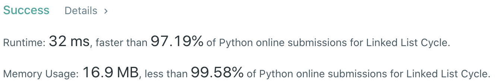
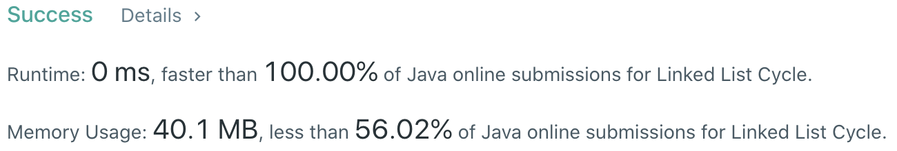

# Problem
[141. Linked List Cycle](https://leetcode.com/problems/linked-list-cycle/)

# Performance



# Python
```Python3
class Solution:
    def hasCycle(self, head: ListNode) -> bool:
        # (base case)
        if not head or not head.next: return False
        if head.next.next == head: return True
        
        # ==================================================
        #  Linked List + Two Pointer                       =
        # ==================================================
        # time  : O(n)
        # space : O(1)
        
        slowP, fastP = head, head
        
        while fastP and fastP.next:
            slowP = slowP.next
            fastP = fastP.next.next
            if slowP == fastP: return True
        
        return False
```

# Java
```Java
class Solution {
    /**
     * @time  : O(n)
     * @space : O(1)
     */
     
    public boolean hasCycle(ListNode head) {
        /* base case */
        if(head == null || head.next == null) return false;
        if(head.next.next == head) return true;
        
        ListNode slowP = head, fastP = head;
        
        while(fastP != null && fastP.next != null) {
            slowP = slowP.next;
            fastP = fastP.next.next;
            if(slowP == fastP) return true;
        }
        
        return false;
    }
}
```
