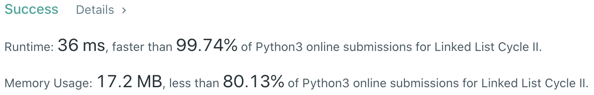

# Problem
[142. Linked List Cycle II](https://leetcode.com/problems/linked-list-cycle-ii)

# Performance



# Proof of Floyd Cycle Chasing (Tortoise and Hare)
```
The distance from the head (inclusive) to the joint (exclusive) is F.
The distance from the joint (inclusive) to the meet point (exclusive) is a.
The distance from the meet point (inclusice) to the joint (exclusive) is C-a.

At meet point, support hare has run n cycles.
2(F + a) = F + nC + a, F + a = nC

We further assign hare to the head and make their speed be the same.
After F steps, hare is at F and turtle is at (nC + F) mod C = F, we find the intersection point.
```

# Python
```Python
class Solution:
    def detectCycle(self, head: ListNode) -> ListNode:
        # (base case)
        if not head or not head.next: return None
        if head == head.next.next: return head

        # ==================================================
        #  Linked List + Two Pointer (Floyd's algorithm)   =
        # ==================================================
        # time  : O(n)
        # space : O(1)

        slowP, fastP = head, head

        # Find the intersection
        while fastP and fastP.next:
            slowP = slowP.next
            fastP = fastP.next.next
            if slowP == fastP: break

        if slowP != fastP: return None

        # Find the cycle entrance
        slowP = head
        while slowP != fastP:
            slowP = slowP.next
            fastP = fastP.next

        return slowP
```

# Java
```Java
class Solution {
    /**
     * @time  : O(n)
     * @space : O(1)
     */
    
    public ListNode detectCycle(ListNode head) {
        /* case case */
        if(head == null || head.next == null) return null;
        if(head == head.next.next) return head;
        
        ListNode slowP = head, fastP = head;
        while(fastP != null && fastP.next != null) {
            slowP = slowP.next;
            fastP = fastP.next.next;
            if(slowP == fastP) break;
        }
        
        if(slowP != fastP) return null;
        
        slowP = head;
        while(slowP != fastP) {
            slowP = slowP.next;
            fastP = fastP.next;
        }
        
        return slowP;
    }
}
```
