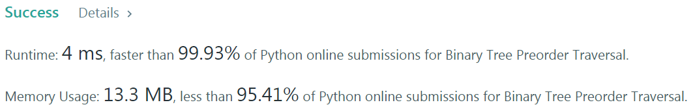
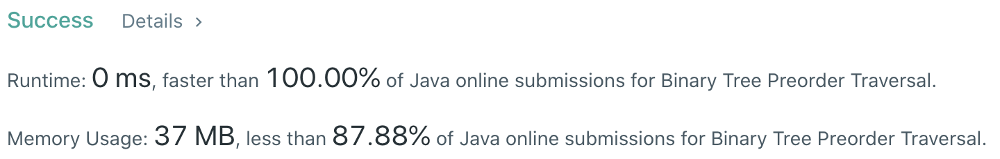

# Problem
[144. Binary Tree Preorder Traversal](https://leetcode.com/problems/binary-tree-preorder-traversal/)

# Performance



# Python
```python
class Solution:
    def preorderTraversal(self, root: TreeNode) -> List[int]:
        # (base case)
        if not root: return []
        if not root.left and not root.right: return [root.val]
        
        # ==================================================
        #  Binary Tree + Pre-order Traversal               =
        # ==================================================
        # time  : O(n)
        # space : O(n)
        
        ans = []
        stack = [root]
        
        while stack:
            node = stack.pop()
            ans.append(node.val)
            
            if node.right: stack.append(node.right)
            if node.left: stack.append(node.left)
                
        return ans
        
        '''
        # ==================================================
        #  Binary Tree + Pre-order Traversal               =
        # ==================================================
        # time  : O(n)
        # space : O(n)

        return [root.val] + self.preorderTraversal(root.left) + self.preorderTraversal(root.right)
        '''
```

# Java
```Java
class Solution {
    /**
     * @time  : O(n)
     * @space : O(n)
     */
    
    public List<Integer> preorderTraversal(TreeNode root) {
        /* base case */
        if(root == null) return new ArrayList<>();
        
        List<Integer> result = new ArrayList<>();
        Stack<TreeNode> stack = new Stack<TreeNode>();
        stack.push(root);
        
        while(!stack.isEmpty()) {
            TreeNode node = stack.pop();
            result.add(node.val);
            
            if(node.right != null) stack.push(node.right);
            if(node.left != null) stack.push(node.left);
        }
        
        return result;
    }
}
```