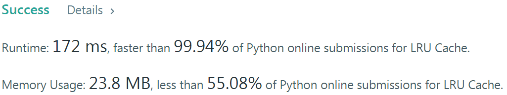

# Problem
[146. LRU Cache](https://leetcode.com/problems/lru-cache)

# Performance


# Python
```Python3
class Node:
    def __init__(self, key=-1, val=-1):
        self.key  = key
        self.val  = val
        self.prev = None
        self.next = None
        
class LRUCache:
    
    # ==================================================
    #  Linked List + Hash Table                        =
    # ==================================================
    
    def __init__(self, capacity: int):
        self.size  = capacity
        self.table = dict()
        
        #: LRU element is at HEAD.NEXT
        self.head = Node()
        self.tail = self.head

    def moveToTail(self, node):
        #: break current link
        node.prev.next = node.next
        node.next.prev = node.prev
        
        #: add to TAIL
        self.tail.next = node
        node.next = None
        node.prev = self.tail
        self.tail = node
        
    def get(self, key: int) -> int:
        if key not in self.table: return -1
        
        node = self.table[key]
        ret  = node.val
        
        #: (recently used) move to TAIL
        if node != self.tail: self.moveToTail(node)
        
        return ret

    def put(self, key: int, value: int) -> None:
        if key in self.table:
            node = self.table[key]
            node.val = value
            
            #: (recently used) move to TAIL
            if node != self.tail: self.moveToTail(node)
                
        else:
            node = Node(key, value)
            self.table[key] = node
            
            #: add to TAIL
            self.tail.next = node
            node.prev = self.tail
            self.tail = node
            
            #: remove LRU element at HEAD.NEXT, del from hash table
            if len(self.table) > self.size:
                node = self.head.next
                node.prev.next = node.next
                node.next.prev = node.prev
                
                del self.table[node.key]
```

```Python3
from collections import OrderedDict

class LRUCache(OrderedDict):

    # ==================================================
    #  OrderedDict                                     =
    # ==================================================

    def __init__(self, capacity: int):
        self.capacity = capacity
        
    def get(self, key: int) -> int:
        if key not in self: return -1
        
        self.move_to_end(key)
        
        return self[key]
        
    def put(self, key: int, value: int) -> None:
        if key in self: self.move_to_end(key)
            
        self[key] = value
        
        if len(self) > self.capacity:
            self.popitem(last = False)
```

# Java (ongoing)
```Java
```
