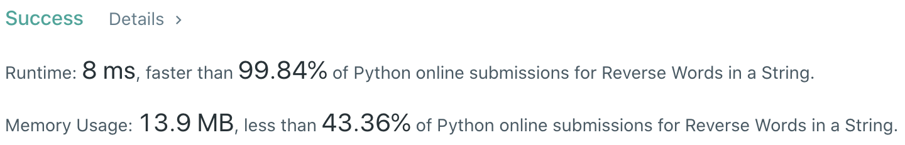
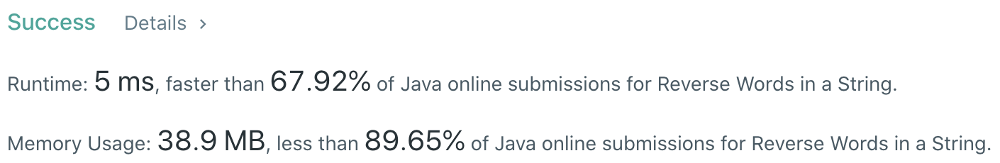

# Problem
[151. Reverse Words in a String](https://leetcode.com/problems/reverse-words-in-a-string/)

# Performance



# Python
```Python
class Solution:
    def reverseWords(self, s: str) -> str:
        
        # ==================================================
        #  String                                          =
        # ==================================================
        # time  : O(n), n is the length of s
        # space : O(m), m is the number of words in s
        
        l, r = 0, len(s) - 1
        while s[l] == ' ': l += 1
        while s[r] == ' ': r -= 1
            
        words, word = [], ''
        while l <= r:
            if s[l] == ' ':
                if word: words.append(word)
                word = ''
                l += 1
                continue
                
            word += s[l]
            l += 1
        
        if word: words.append(word)
        
        ans = ''
        for i in range(len(words)-1, -1, -1):
            ans += words[i] + ' '
            
        return ans[:-1]
```

```Python
class Solution:
    def reverseWords(self, s: str) -> str:
        return ' '.join( reversed( s.split() ) )
```

# Java
```Java
class Solution {
    /**
     * @time  : O(n), n is the length of input string
     * @space : O(m), m is the number of words in the input string
     */
    
    public String reverseWords(String s) {
        int l = 0, r = s.length() - 1;
        while(l <= r && s.charAt(l) == ' ') ++l;
        while(l <= r && s.charAt(r) == ' ') --r;

        Deque<String> d = new ArrayDeque();
        StringBuilder word = new StringBuilder();
        
        while(l <= r) {
            char c = s.charAt(l);

            if((word.length() != 0) && (c == ' ')) {
                d.offerFirst(word.toString());
                word.setLength(0);
            } else if(c != ' ') {
                word.append(c);
            }
            ++l;
        }
        
        d.offerFirst(word.toString());
        return String.join(" ", d);
    }
}
```