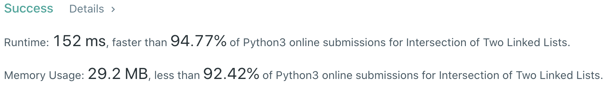

# Problem
[160. Intersection of Two Linked Lists](https://leetcode.com/problems/intersection-of-two-linked-lists)

# Performance



# Python
```Python3
class Solution:
    def getIntersectionNode(self, headA: ListNode, headB: ListNode) -> ListNode:
        
        # ==================================================
        #  Linked List + Two Pointer                       =
        # ==================================================
        # time  : O(n+m)
        # space : O(1)
        # note  : A + shared path + B = B + shared path + A
        
        pA, pB = headA, headB
        while pA != pB:
            pA = pA.next if pA else headB
            pB = pB.next if pB else headA
            
        return pA
```

```Python3
class Solution:
    def getIntersectionNode(self, headA: ListNode, headB: ListNode) -> ListNode:
        
        # ==================================================
        #  Linked List + Two Pointer                       =
        # ==================================================
        # time  : O(max(n,m))
        # space : O(1)
        # note  : Find the length, then align two head pointers
        
        pA, pB, lenA, lenB = headA, headB, 0, 0
        while pA or pB:
            if pA: 
                lenA += 1
                pA = pA.next
                
            if pB: 
                lenB += 1
                pB = pB.next
                
        if lenA > lenB:
            for i in range(lenA - lenB):
                headA = headA.next
        elif lenA < lenB:
            for i in range(lenB - lenA):
                headB = headB.next
                
        while headA != headB:
            headA = headA.next
            headB = headB.next
            
        return headA
```

```Python3
class Solution:
    def getIntersectionNode(self, headA: ListNode, headB: ListNode) -> ListNode:
        
        # ==================================================
        #  Linked List + Set                               =
        # ==================================================
        # time  : O(max(n,m))
        # space : O(n+m)
        
        setA, setB = set(), set()
        
        while headA or headB:
            if headA:
                if headA in setB: return headA
                setA.add(headA)
                headA = headA.next
            
            if headB:
                if headB in setA: return headB
                setB.add(headB)
                headB = headB.next
                
        return None
```

# Java
```Java
class Solution {
    /**
     * @time  : O(n)
     * @space : O(1)
     */
     
    public ListNode getIntersectionNode(ListNode headA, ListNode headB) {
        ListNode pA = headA, pB = headB;
        
        while(pA != pB) {
            pA = (pA != null) ? pA.next : headB;
            pB = (pB != null) ? pB.next : headA;
        }
        
        return pA;
    }
}
```
