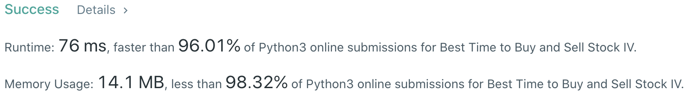

# Problem
[188. Best Time to Buy and Sell Stock IV](https://leetcode.com/problems/best-time-to-buy-and-sell-stock-iv/)

# Performance



# Python
```Python
class Solution:
    def maxProfit(self, k: int, prices: List[int]) -> int:
        
        """
        # ==================================================
        #  [Array] DP                                      =
        # ==================================================
        # time  : O(nk)
        # space : O(k)
        """
        
        # (base case)
        if len(prices) == 1: return 0
        
        T = k + 1
        hold, sell = [float('-inf')] * T, [0] * T
        
        for price in prices:
            for i in range(1, T):
                preHold, preSell = hold[i], sell[i]

                hold[i] = max(preHold, sell[i-1] - price)
                sell[i] = max(preSell, preHold + price)
            
        return max(sell)
```

# Java
```Java
class Solution {
    public int maxProfit(int k, int[] prices) {
        /* base case */
        if(prices.length == 0 || prices.length == 1) return 0;
        
        int T = k + 1;
        
        int[] hold = new int[T], noHold = new int[T];
        Arrays.fill(hold,   Integer.MIN_VALUE);
        Arrays.fill(noHold, 0);
        
        for(int price: prices) {
            for(int i=1 ; i<T ; i++) {
                int preHold = hold[i], preNoHold = noHold[i];
                
                hold[i]   = Math.max(preHold,   noHold[i-1] - price);
                noHold[i] = Math.max(preNoHold, preHold     + price);
            }
        }
        
        return noHold[T - 1];
    }
}
}
```
