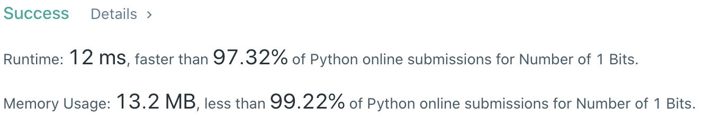
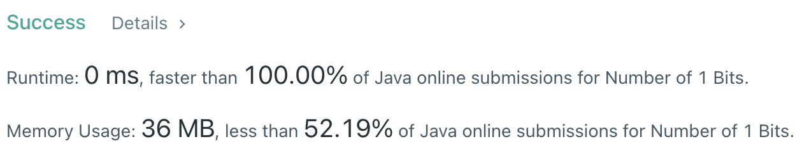

# Problem
[191. Number of 1 Bits](https://leetcode.com/problems/number-of-1-bits/)

# Performance



# Python
```Python
class Solution:
    def hammingWeight(self, n: int) -> int:
        
        # ==================================================
        #  Bit Manipulation                                =
        # ==================================================
        # time  : O(1)
        # space : O(1)
        
        ans = 0
        
        while n:
            # remove the rightmost in binary representation of n
            n &= (n-1)
            ans += 1
            
        return ans
        
        '''
        # ==================================================
        #  Math                                            =
        # ==================================================
        # time  : O(1)
        # space : O(1)
        
        ans = 0
        
        while n:
            if n & 1: ans += 1
            n >>= 1
            
        return ans
        '''
```

# Java
```Java
class Solution {
    /**
     * @time  : O(1)
     * @space : O(1)
     */
     
    public int hammingWeight(int n) {
        int bits = 0;
        int mask = 1;
        
        for (int i=0 ; i<32 ; i++) {
            if((n & mask) != 0) bits++;
            mask <<= 1;
        }
        
        return bits;
    }
}
```