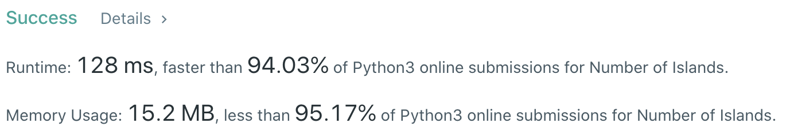
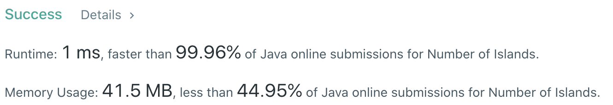

# Problem
[200. Number of Islands](https://leetcode.com/problems/number-of-islands)

# Performance



# Python
```Python
class Solution:
    def numIslands(self, grid: List[List[str]]) -> int:
        # (base case)
        if len(grid) == 1 and len(grid[0]) == 1: return 1 if grid[0][0] == "1" else 0
        
        # ==================================================
        #  BFS                                             =
        # ==================================================
        # time  : O(mn)
        # space : O(min(m,n))
        
        x = len(grid[0])
        y = len(grid)
        
        ans = 0
        
        for i in range(y):
            for j in range(x)):
                if grid[i][j] == '1':
                    ans += 1
                    
                    visited = set()
                    visited.add( (i, j) )
                    
                    while visited:
                        row, col = visited.pop()
                        grid[row][col] = '0'
                        
                        if row   > 0 and grid[row-1][col] == '1': visited.add( (row-1, col) )
                        if row+1 < y and grid[row+1][col] == '1': visited.add( (row+1, col) )
                        if col   > 0 and grid[row][col-1] == '1': visited.add( (row, col-1) )
                        if col+1 < x and grid[row][col+1] == '1': visited.add( (row, col+1) )
                            
        return ans
```

```Python
class Solution:
    def numIslands(self, grid: List[List[str]]) -> int:
        # (base case)
        if len(grid) == 1 and len(grid[0]) == 1: return 1 if grid[0][0] == "1" else 0
        
        # ==================================================
        #  DFS                                             =
        # ==================================================
        # time  : O(mn)
        # space : O(mn)

        island = 0
        self.grid = grid
        
        for i in range(len(grid)):
            for j in range(len(grid[0])):
                if grid[i][j] == '1': 
                    self.explore(i, j)
                    island += 1
        
        return island
        
    def explore(self, y: int, x: int) -> None:
        self.grid[y][x] = 0
        
        if y > 0                     and self.grid[y-1][x] == '1': self.explore(y-1, x)
        if y < len(self.grid) - 1    and self.grid[y+1][x] == '1': self.explore(y+1, x)
        if x > 0                     and self.grid[y][x-1] == '1': self.explore(y, x-1)
        if x < len(self.grid[0]) - 1 and self.grid[y][x+1] == '1': self.explore(y, x+1)
```

# Java
```Java
class Solution {
    /**
     * @time  : O(nm)
     * @space : O(nm)
     */
    
    char[][] map;

    public int numIslands(char[][] grid) {
        int count = 0;
        
        map = grid;
        
        for(int i=0 ; i<grid.length ; i++) {
            for(int j=0 ; j<grid[0].length ; j++) {
                if(grid[i][j] == '1') {
                    count++;
                    explore(i, j);
                }
            }
        }
        
        return count;
    }
    
    public void explore(int x, int y) {
        if(x<0 || y<0 || x>= map.length || y>= map[0].length) {
            return;
        }
        
        if(map[x][y] == '0') {
            return;
        }
        
        map[x][y] = '0';
        
        explore(x-1, y);
        explore(x+1, y);
        explore(x,   y-1);
        explore(x,   y+1);
        
        return;
    }
}
```