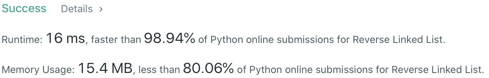

# Problem
[206. Reverse Linked List](https://leetcode.com/problems/reverse-linked-list)

# Performance


# Python
```Python3
class Solution:
    def reverseList(self, head: ListNode) -> ListNode:
        #: (base case)
        if not head: return head
        if not head.next: return head
        
        # ==================================================
        #  Linked List                       (Iterative)   =
        # ==================================================
        # time  : O(n)
        # space : O(1)
        
        prev = None
        
        while head:
            #: STORE next node for next iteration
            tmp = head.next
            
            #: RE-ASSIGN next pointer to prev node
            head.next = prev
            
            #: ASSIGN prev node to current node
            prev = head
            
            #: MOVE current node to next node
            head = tmp
        
        return prev
```

```Python3
class Solution:
    def reverseList(self, head: ListNode) -> ListNode:
        #: (base case)
        if not head: return head
        if not head.next: return head
        
        # ==================================================
        #  Linked List                       (Recursive)   =
        # ==================================================
        # time  : O(n)
        # space : O(n)
        #                                             5-4-n
        # 1-2-3-4(head)-5(node)  ➜  1-2-3-4=5  ➜  1-2-3-4-n
        #
        #     5(node)-4-n             5-4-3       5-4-3-n
        # 1-2-3(head)-4-n        ➜  1-2-3=4    ➜  1-2-3-n
        
        node = self.reverseList(head.next)
        
        #: recursion will end at the last-two element since head.next == None
        head.next.next = head
        head.next = None
        
        return node
```

# Java
```Java
class Solution {
    /**
     * @time  : O(n)
     * @space : O(1)
     */
    public ListNode reverseList(ListNode head) {
        if( head == null || head.next == null ) return head;
        
        ListNode prev = null;
        while( head != null ){
            ListNode tmp = head.next;
            head.next = prev;
            prev = head;
            head = tmp;
        }
        return prev;
    }
}
```
