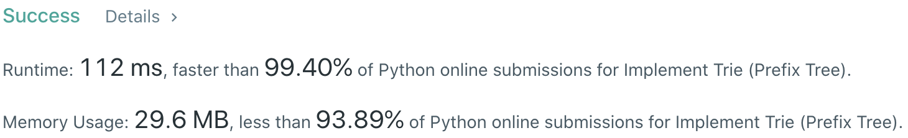
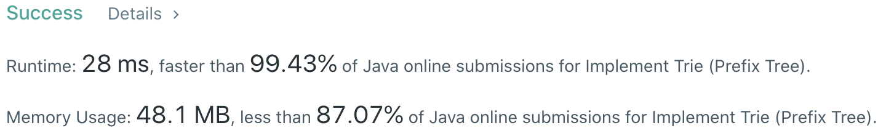

# Problem
[208. Implement Trie (Prefix Tree)](https://leetcode.com/problems/implement-trie-prefix-tree/)

# Performance



# Python
```Python
class Trie:

    def __init__(self):
        self.root = {}
        

    def insert(self, word: str) -> None:
        # time  : O(n), n is the lenght of str
        # space : O(n)
        
        cur = self.root
        
        for char in word:
            if char not in cur: cur[char] = {}            
            cur = cur[char]
            
        cur['#'] = True
        

    def search(self, word: str) -> bool:
        # time  : O(n)
        # space : O(1)
        
        cur = self.root
        
        for char in word:
            if char not in cur: return False
            cur = cur[char]
            
        return '#' in cur
        

    def startsWith(self, prefix: str) -> bool:
        # time  : O(n)
        # space : O(1)
        
        cur = self.root
        
        for char in prefix:
            if char not in cur: return False
            cur = cur[char]
            
        return True
```

# Java
```Java
class Trie {
    Trie[]  arr;
    boolean wordEnd;
    
    /*  Initialize your data structure here  */
    public Trie() {
        arr = new Trie[26];
    }
    
    
    /*  Inserts a word into the trie  */
    public void insert(String word) {
        insert( word, 0 );
    }
    
    private void insert(String word, int i) {
        if( i == word.length() ) {
            wordEnd = true;
            return;
        }
        
        int index = word.charAt(i) - 'a';
        if( arr[index] == null ) arr[index] = new Trie();
        
        arr[index].insert(word, i + 1);
    }
    
    
    /*  Returns if the word is in the trie  */
    public boolean search(String word) {
        return search( word, 0 );
    }
    
    private boolean search(String word, int i) {
        if( i == word.length() ) return wordEnd;
        
        int index = word.charAt(i) - 'a';
        
        if( arr[index] == null ) return false;
        else return arr[index].search( word, i + 1 );
    }
    
    
    /*  Returns if there is any word in the trie that starts with the given prefix  */
    public boolean startsWith(String prefix) {
        return startsWith( prefix, 0 );
    }
    
    public boolean startsWith(String prefix, int i) {
        if( i == prefix.length() ) return true;
        
        int index = prefix.charAt(i) - 'a';
        
        if( arr[index] == null ) return false;
        else return arr[index].startsWith( prefix, i + 1 );
    }
}
```
