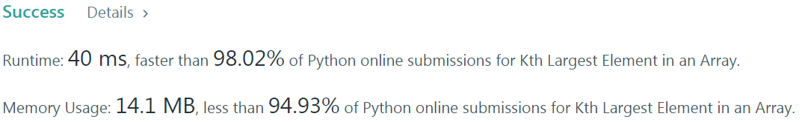

# Problem
[215. Kth Largest Element in an Array](https://leetcode.com/problems/kth-largest-element-in-an-array)

# Performance


# Python
```Python3
class Solution:
    def findKthLargest(self, nums: List[int], k: int) -> int:
        # (base case)
        if len(nums) == 1: return nums[0]
        
        # ==================================================
        #  Array + Quickselect (k largest = n-k smallest)  =
        # ==================================================
        # time  : O(n)
        # space : O(1)
        
        self.nums = nums
        return self.quickSelect(0, len(nums) - 1, k - 1)
    
    def quickSelect(self, left, right, kLargest) -> int:
        while left <= right:
            pivot = self.partition(left, right)
            if pivot == kLargest: return self.nums[kLargest]
            elif pivot > kLargest: right = pivot - 1
            else: left = pivot + 1
                
    def partition(self, left, right) -> int:
        randomNum = (left + right) // 2
        
        #  move pivot to the end/right
        pivot = right
        self.nums[randomNum], self.nums[pivot] = self.nums[pivot], self.nums[randomNum]
        
        #  move all larger elements to the left
        placeP = left
        for i in range(left, right):
            if self.nums[i] >= self.nums[pivot]:
                self.nums[placeP], self.nums[i] = self.nums[i], self.nums[placeP]
                placeP += 1
            
        #  move back the pivot to make an almost-sorted array
        self.nums[placeP], self.nums[pivot] = self.nums[pivot], self.nums[placeP]
        return placeP
```

# Java
```Java
class Solution {
    /**
     * @time  : O(n)
     * @space : O(1)
     */
    int[] nums;
    
    public int findKthLargest(int[] nums, int k) {
        /* base case */
        if(nums.length == 1) return nums[0];
        
        this.nums = nums;
        return quickSelect(0, nums.length - 1, k - 1);
    }
    
    public int quickSelect(int left, int right, int k) {
        while(left <= right) {
            int pivot = partition(left, right);
            if(pivot == k) return this.nums[k];
            else if(pivot > k) right = pivot - 1;
            else left = pivot + 1;
        }
        
        return this.nums[k];
    }
    
    public int partition(int left, int right) {
        int randomNum = (left + right) / 2;
        int pivot = right;
        
        /* move pivot to the end/right */
        int tmp = this.nums[randomNum];
        this.nums[randomNum] = this.nums[pivot];
        this.nums[pivot] = tmp;
        
        /* move larger elements to the left */
        int placeP = left;
        for(int i=left ; i<right ; i++) {
            if(this.nums[i] >= this.nums[pivot]) {
                tmp = this.nums[i];
                this.nums[i] = this.nums[placeP];
                this.nums[placeP] = tmp;
                
                placeP++;
            }
        }
        
        /* move back pivot */
        tmp = this.nums[placeP];
        this.nums[placeP] = this.nums[pivot];
        this.nums[pivot] = tmp;
            
        return placeP;
    }
}
```
