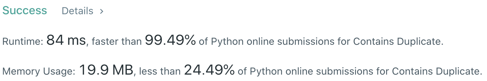
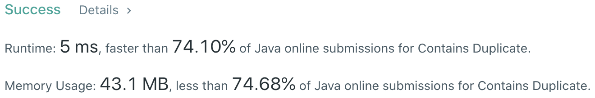

# Problem
[217. Contains Duplicate](https://leetcode.com/problems/contains-duplicate)

# Performance



# Python
```Python3
class Solution:
    def containsDuplicate(self, nums: List[int]) -> bool:
        #  (base case)
        if len(nums) == 1: return False
        
        # ==================================================
        #  Array + Hash Table                              =
        # ==================================================
        # time  : O(n)
        # space : O(n)
        
        table = set()
        
        for num in nums:
            if num not in table: table.add(num)
            else: return True
        
        return False
    
        '''
        return len(nums) != len(set(nums))
        '''
```

# Java
```Java
class Solution {
    /**
     * @time  : O(n)
     * @space : O(n)
     */
    
    public boolean containsDuplicate(int[] nums) {
        Set<Integer> set = new HashSet<>(nums.length);
        
        for (int x: nums) {
            if (set.contains(x)) return true;
            set.add(x);
        }
        
        return false;
    }
}
```
