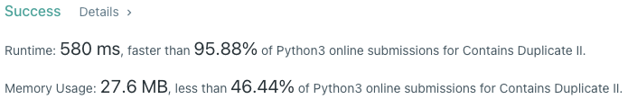

# Problem
[219. Contains Duplicate II](https://leetcode.com/problems/contains-duplicate-ii/)

# Performance



# Python
```Python3
class Solution:
    def containsNearbyDuplicate(self, nums: List[int], k: int) -> bool:
        # (base case)
        if len(nums) == 1: return False

        # ==================================================
        #  Array + Hash Table (store value/index pairs)    =
        # ==================================================
        # time  : O(n)
        # space : O(n)

        table = dict()

        for i in range(len(nums)):
            num = nums[i]

            if num in table and i - table[num] <= k:
                return True

            table[num] = i

        return False
```

# Java
```Java
class Solution {
    /**
     * @time  : O(n)
     * @space : O(n)
     */
    
    public boolean containsNearbyDuplicate(int[] nums, int k) {
        /* base case */
        if(nums.length == 1) return false;
        
        HashMap<Integer, Integer> table = new HashMap<>();
        
        for( int i=0 ; i<nums.length ; i++) {
            int num = nums[i];
            
            if(table.containsKey(num) && i - table.get(num) <= k) return true;
            
            table.put(num, i);
        }
        
        return false;
    }
}
```
