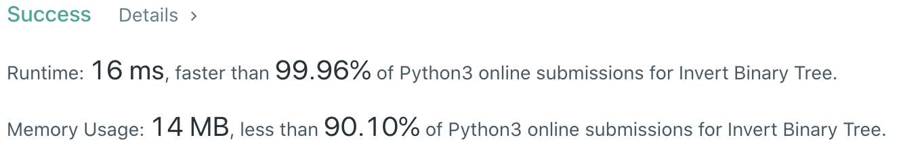
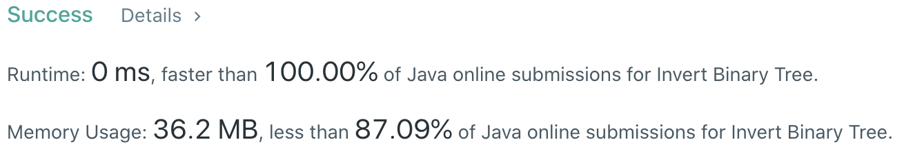

# Problem
[226. Invert Binary Tree](https://leetcode.com/problems/invert-binary-tree/)

# Performance



# Python
```python
class Solution:
    def invertTree(self, root: TreeNode) -> TreeNode:
        # (base case)
        if (not root) or (not root.left and not root.right): return root
        
        # ==================================================
        #  Binary Tree                       (Iterative)   =
        # ==================================================
        # time  : O(n)
        # space : O(n)
        
        stack = [root]
        while stack:
            node = stack.pop()
                
            node.left, node.right = node.right, node.left
            if node.right: stack.append(node.right)
            if node.left: stack.append(node.left)
            
        return root
```

```python
class Solution:
    def invertTree(self, root: TreeNode) -> TreeNode:
        # (base case)
        if (not root) or (not root.left and not root.right): return root

        # ==================================================
        #  Tree                              (Recursive)   =
        # ==================================================
        # time  : O(n)
        # space : O(n)
        
        root.left, root.right = root.right, root.left
        self.invertTree(root.left)
        self.invertTree(root.right)
        
        return root
```

# Java
```Java
class Solution {
    /**
     * @time  : O(n)
     * @space : O(n)
     */

    public TreeNode invertTree(TreeNode root) {
        if((root == null) || (root.left == null && root.right == null)) return root;
        
        TreeNode tmp = root.left;
        root.left  = root.right;
        root.right = tmp;
           
        invertTree(root.left);
        invertTree(root.right);
        
        return root;
    }
}
```