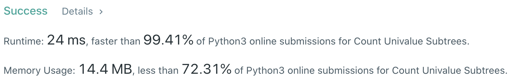
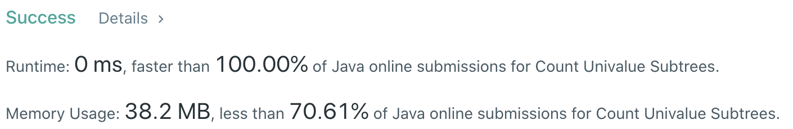

# Problem
[250. Count Univalue Subtrees](https://leetcode.com/problems/count-univalue-subtrees/)

# Performance



# Python
```python
class Solution:
    def countUnivalSubtrees(self, root: TreeNode) -> int:
        # (base case)
        if not root: return 0
        if not root.left and not root.right: return 1
        
        # ==================================================
        #  Binary Search Tree + DFS                        =
        # ==================================================
        # time  : O(n)
        # space : O(H)

        self.unival = 0
        self.dfs(root, root.val)
        
        return self.unival
        
    def dfs(self, node: TreeNode, preVal: int) -> bool:
        if not node: return True
        
        left  = self.dfs(node.left,  node.val)
        right = self.dfs(node.right, node.val)
        
        if not left or not right:
            return False
        
        self.unival += 1
        
        return node.val == preVal
        
```

# Java
```Java
class Solution {
    /**
     * @time  : O(n)
     * @space : O(H)
     */

    int count = 0;

    public int countUnivalSubtrees(TreeNode root) {
        /* base case */
        if(root == null) return 0;
        if(root.left == null && root.right == null) return 1;
        
        dfs(root, root.val);
        return count;
    }
    
    private boolean dfs(TreeNode node, int val) {
        if (node == null)
            return true;
        
        boolean left  = dfs(node.left, node.val);
        boolean right = dfs(node.right, node.val);
        
        if(!left || !right)
            return false;
        
        count++;
        
        return node.val == val;
    }
}
```