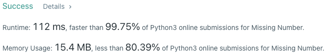

# Problem
[268. Missing Number](https://leetcode.com/problems/missing-number)

# Performance



# Python
```Python
class Solution:
    def missingNumber(self, nums: List[int]) -> int:
        
        # ==================================================
        #  Math                                            =
        # ==================================================
        # time  : O(n) for SUM operation
        # space : O(1)
        
        total = sum(nums)
        expectSum = len(nums)*(len(nums) + 1) // 2
        return expectSum - total
```

```Python3
class Solution:
    def missingNumber(self, nums: List[int]) -> int:
        
        # ==================================================
        #  Bit Manipulation                                =
        # ==================================================
        # time  : O(n)
        # space : O(1)
        #
        # missing = 4 ∧ (0∧0) ∧ (1∧1) ∧ (2∧3) ∧ (3∧4)
        #         = (4∧4) ∧ (0∧0) ∧ (1∧1) ∧ (3∧3) ∧ 2
        #         = 0 ∧ 0 ∧ 0 ∧ 0 ∧ 2
        #         = 2
        
        ans = len(nums)
        
        for i in range(ans):
            ans ^= i ^ nums[i]
            
        return ans
```

# Java
```Java
class Solution {
    /**
     * @time  : O(n)
     * @space : O(1)
     */
    public int missingNumber(int[] nums) {
        int total = 0;
        for(int num: nums) total += num;
        int expectedSum = nums.length * (nums.length + 1) / 2;
        
        return expectedSum - total;
    }
}
```
