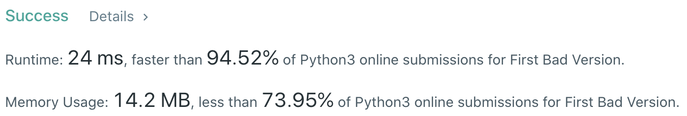
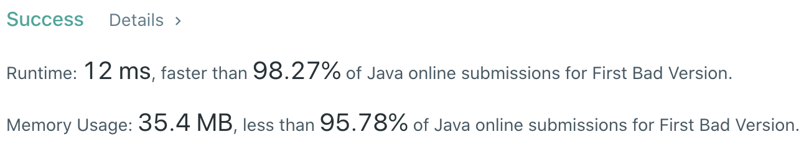

# Problem
[278. First Bad Version](https://leetcode.com/problems/first-bad-version/)

# Performance



# Python
```Python
# The isBadVersion API is already defined for you.
# @param version, an integer
# @return an integer
# def isBadVersion(version):

class Solution:
    def firstBadVersion(self, n):
        # (base case)
        if n == 1: return 1
        if n == 2: return 1 if isBadVersion(1) else 2
        
        # ==================================================
        #  Binary Search                                   =
        # ==================================================
        # time  : O(log(n))
        # space : O(1)

        l, r = 1, n
        while l < r:
            mid = (l + r) // 2
            
            if isBadVersion(mid): r = mid
            else: l = mid + 1
                
        return l
```

# Java
```Java
/* The isBadVersion API is defined in the parent class VersionControl.
      boolean isBadVersion(int version); */

public class Solution extends VersionControl {
    /**
     * @time  : O(log(n))
     * @space : O(1)
     */
    
    public int firstBadVersion(int n) {
        /* base case */
        if (n == 1) return 1;
        
        int l = 1, r = n;
        while(l < r) {
            int mid = l + (r - l) / 2;
            
            if(isBadVersion(mid)) r = mid;
            else l = mid + 1;
        }
        
        return l;
    }
}
```