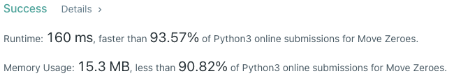

# Problem
[283. Move Zeroes](https://leetcode.com/problems/move-zeroes)

# Performance



# Python
```Python3
class Solution:
    def moveZeroes(self, nums: List[int]) -> None:
        #  (base case)
        if len(nums) == 1: return nums
        
        # ==================================================
        #  Array + Two Pointer                             =
        # ==================================================
        # time  : O(n)
        # space : O(1)
        
        placeP, moveP = 0, 0
        
        while moveP < len(nums):
            if nums[moveP] != 0: 
                nums[placeP], nums[moveP] = nums[moveP], nums[placeP]    
                placeP += 1
            
            moveP += 1
```

# Java
```Java
class Solution {
    /**
     * @time  : O(n)
     * @space : O(1)
     */
    
    public void moveZeroes(int[] nums) {
        /* base case */
        if(nums.length == 1) return;
        
        int moveP = 0, placeP = 0;
        
        while(moveP < nums.length) {
            if(nums[moveP] != 0) {
                int tmp = nums[placeP];
                nums[placeP] = nums[moveP];
                nums[moveP] = tmp;
                
                placeP += 1;
            }
            
            moveP += 1;
        }
    }
}
```
