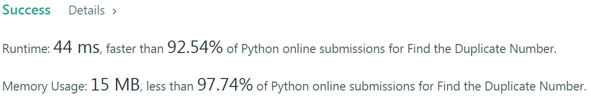
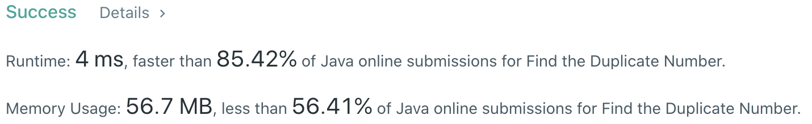

# Problem
[287. Find the Duplicate Number](https://leetcode.com/problems/find-the-duplicate-number)

# Performance



# Python
```Python3
class Solution:
    def findDuplicate(self, nums: List[int]) -> int:
        
        # ==================================================
        #  Array + Two Pointer                             =
        # ==================================================
        # time  : O(n)
        # space : O(1)
        
        slowP, fastP = nums[0], nums[0]
        
        #  (find the intersection)
        while True:
            slowP = nums[slowP]
            fastP = nums[nums[fastP]]
            if slowP == fastP: break
                
        #  (find the entrance of the cycle)
        slowP = nums[0]
        while slowP != fastP:
            slowP = nums[slowP]
            fastP = nums[fastP]
            
        return slowP
```

# Java
```Java
class Solution {
    /**
     * @time  : O(n)
     * @space : O(1)
     */
     
    public int findDuplicate(int[] nums) {
        int slowP = nums[0], fastP = nums[0];
        
        while(true) {
            slowP = nums[slowP];
            fastP = nums[nums[fastP]];
            if(slowP == fastP) break;
        }
        
        slowP = nums[0];
        while(slowP != fastP) {
            slowP = nums[slowP];
            fastP = nums[fastP];
        }
        
        return slowP;
    }
}
```
