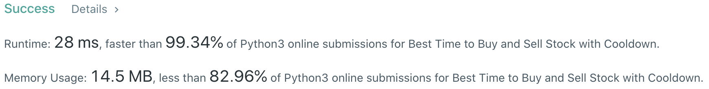

# Problem
[309. Best Time to Buy and Sell Stock with Cooldown](https://leetcode.com/problems/best-time-to-buy-and-sell-stock-with-cooldown)

# Performance



# Python
```Python
class Solution:
    def maxProfit(self, prices: List[int]) -> int:
        #  (base case)
        if len(prices) == 1: return 0
        
        # ==================================================
        #  Array + Dynamic Programming              (FSM)  =
        # ==================================================
        # time  : O(n)
        # space : O(1)

        hold, noHold = float('-inf'), 0
        
        #  after selling stock, you cannot buy stock on the next day = NO HOLD state
        preDaySell = 0
        
        for price in prices:
            preHold, preNoHold = hold, noHold
            
            #  due to cooldown, cannot use preNoHold's profit to buy stock, use preDaySell
            hold   = max(preHold,   preDaySell - price)
            noHold = max(preNoHold, preHold    + price)
            
            #  record at the end to have an one-day gap (still 0 after 1st iteration)
            preDaySell = preNoHold
            
        return noHold
```

# Java
```Java
class Solution {
    /**
     * @time  : O(n)
     * @space : O(1)
     */
     
    public int maxProfit(int[] prices) {
        /* base case */
        if(prices.length == 1) return 0;
        
        int hold = Integer.MIN_VALUE, noHold = 0;
        int preDaySell = 0;
        
        for(int price: prices) {
            int preHold = hold, preNoHold = noHold;
            
            hold   = Math.max(preHold,   preDaySell - price);
            noHold = Math.max(preNoHold, preHold    + price );
            
            preDaySell = preNoHold;
        }
        
        return noHold;
    }
}
```